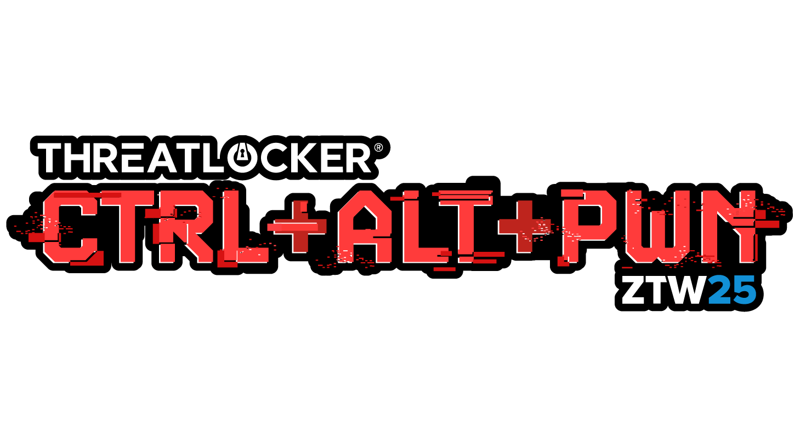

# Welcome to CTRL+ALT+PWN for ZTW 2025!

## Scenario

Your company has been hit by ransomware from the Threa7 ransom gang, and you
don't have the funds to pay the ransom.

However, you discovered a tip on an underground forum that reveals where Threa7
stores the recovery keys for all their victims.

Your mission is to compromise their infrastructure and obtain the recovery key
for your organization to decrypt your files.

## Mission

Infiltrate Threa7's network to retrieve the recovery key for your organization,
which will allow you to recover your precious photos of your long-lost pet and
your company data.

## Scope

### Instance A: 192.168.68.60

### Instance B: 192.168.68.61

### Instance C: 192.168.68.62

### Instance D: 192.168.68.63

## Rules

1. Do not interact with any devices outside the specified scope.
2. Do not perform any denial of service attacks.
3. Do not perform any Wi-Fi deauthentication attacks.
4. Do not attempt to tamper with the computer physically.
5. Do not attempt to plug any devices into the computer.
6. Do not attempt to unplug or tamper with the Wi-Fi infrastructure.
7. Only attack one instance.
8. Be mindful of other users, especially when performing password bruteforce
   attacks.
9. No asking for hints, ThreatLocker employees can't help you even if they
   wanted to.

## Wi-Fi Access

Wi-Fi SSID: `CTRLALTPWN`

Password: `ZTW2025!`

## How To Win

The first person to successfully find and submit the correct flag to the
Microsoft form [here](https://forms.office.com/r/6xmFX1e7hv) will be awarded the
CTRL+ALT+PWN prize computer.

> In the event no one has submitted the correct flag to the Microsoft form, the
> prize computer will be awarded to whoever scores the highest on the Cyber Hero
> Certification Exam.

## Step-By-Step Writeup

[Writeup Link](Writeup/README.md)

