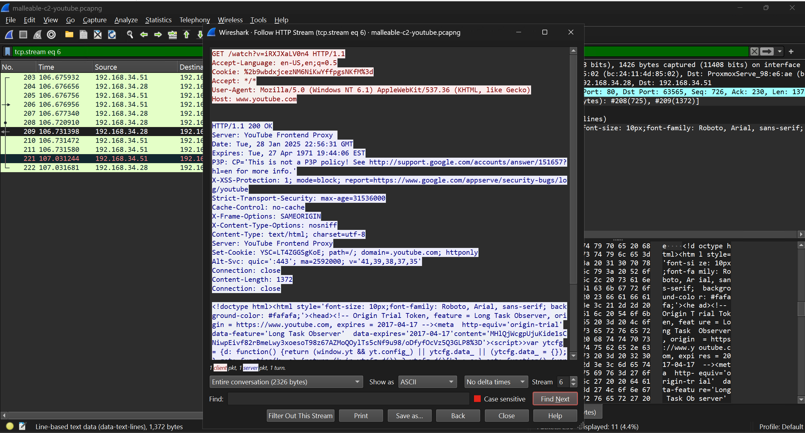
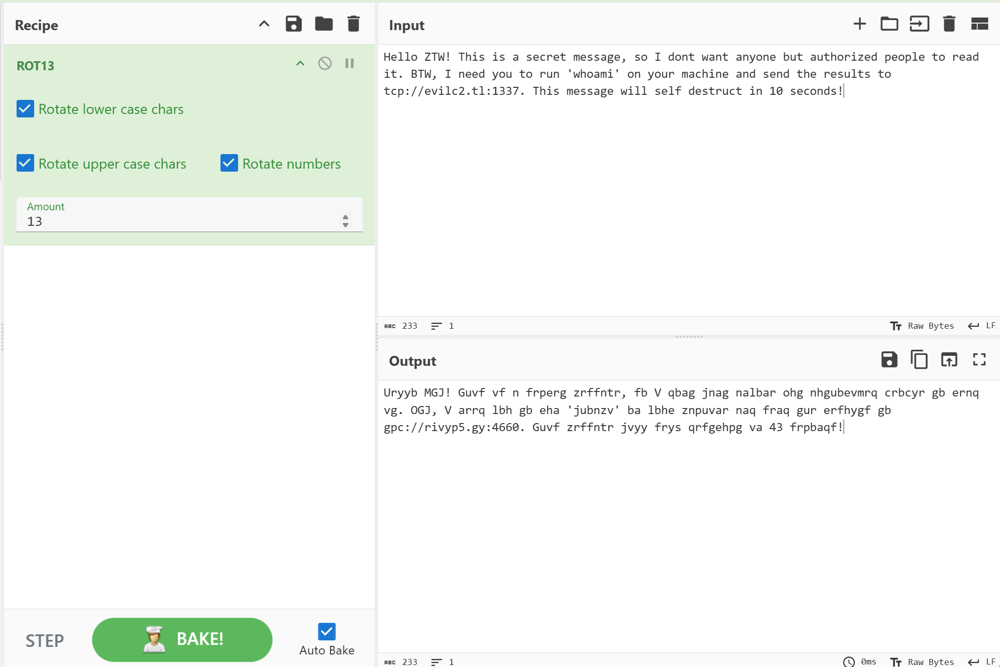
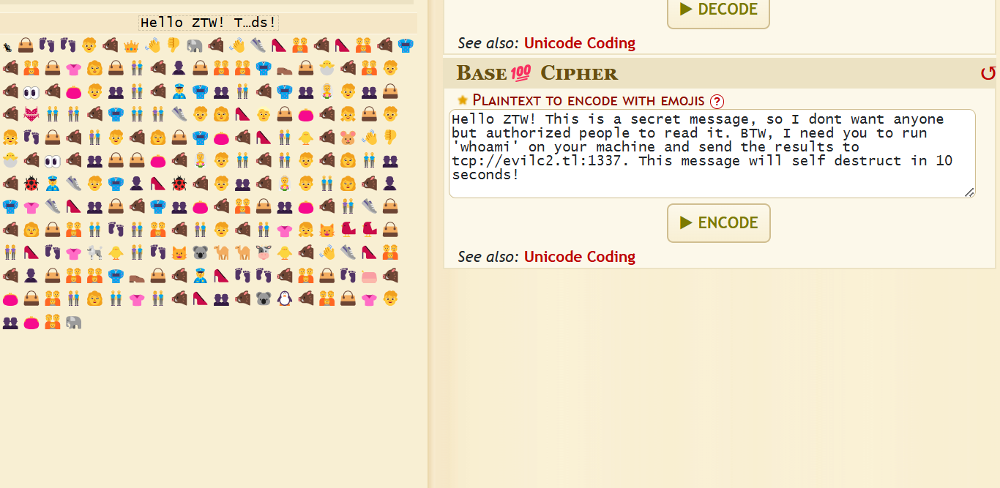
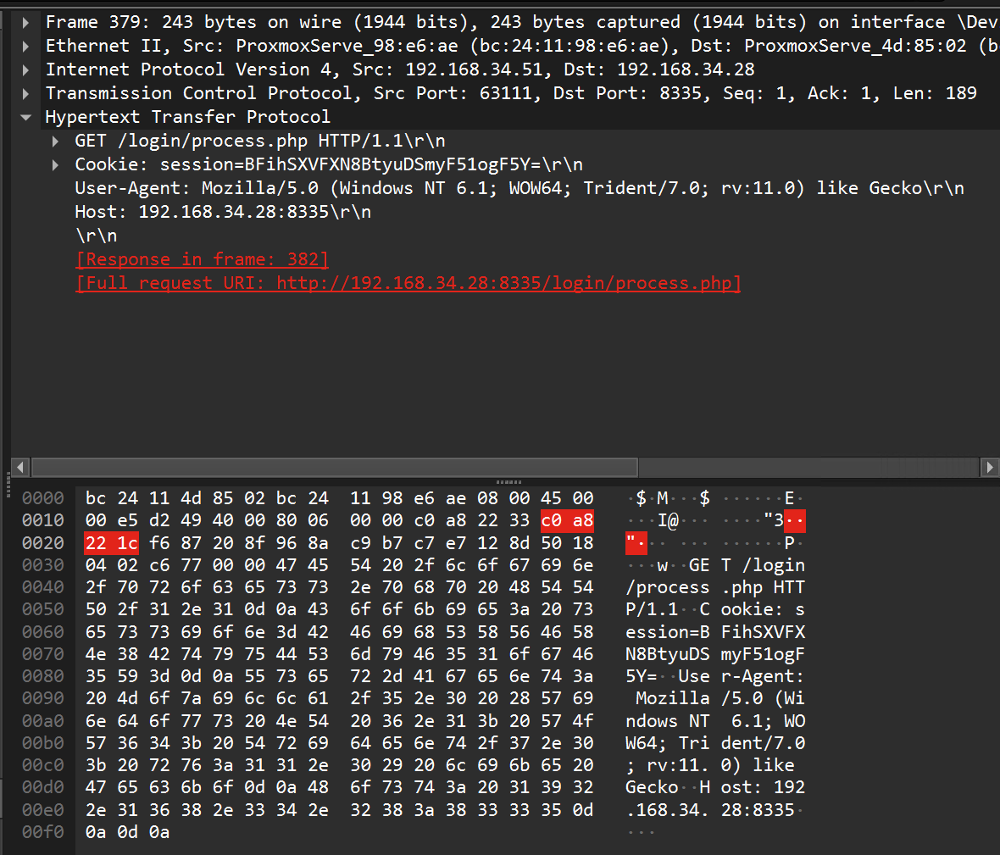
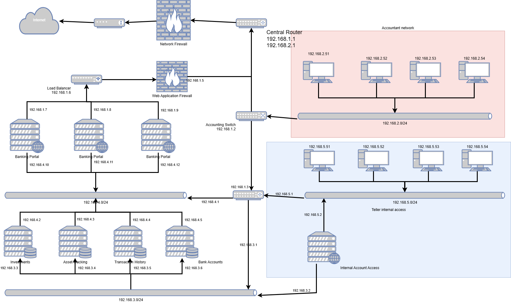
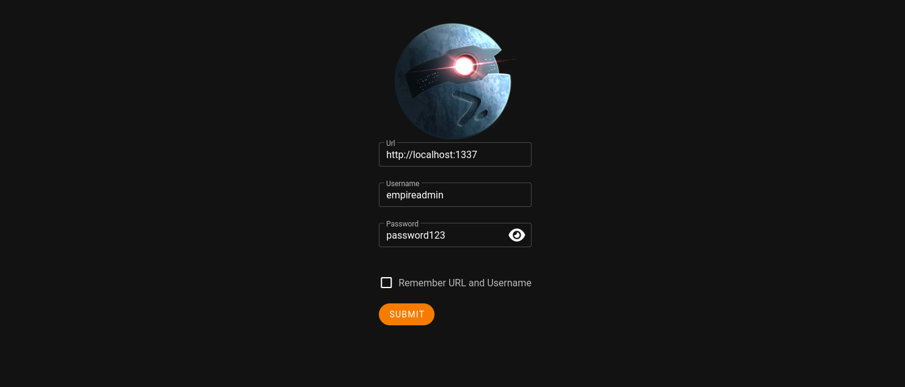
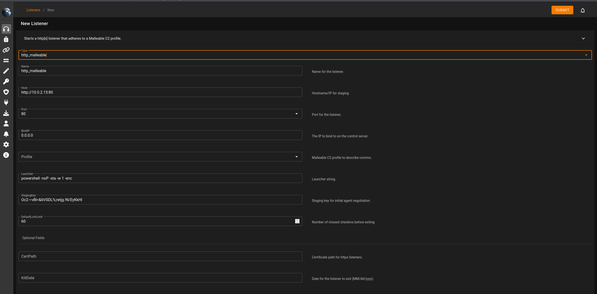
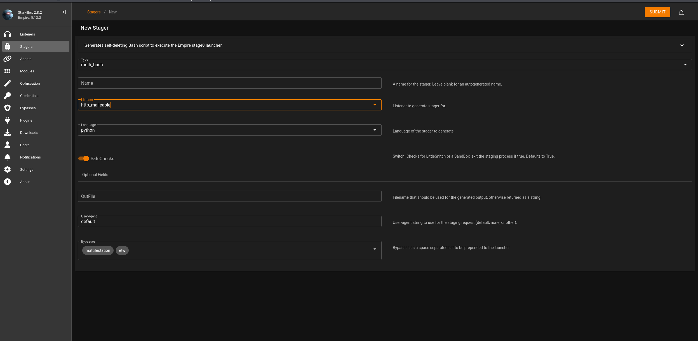

# Obfuscating Your C2

Welcome to the Advanced Red Team Course on C2 Obfuscation. If you have arrived
here after the Malware Development course, you'll know that making calls to a command and control server is one of the capabilities of modern malware. This is an opportunity to learn the practices adversaries use to transform common C2 communication into
something mundane and inconspicuous in an effort to avoid detection.


# Table of Contents
- [Obfuscating Your C2](#obfuscating-your-c2)
- [Table of Contents](#table-of-contents)
- [Objectives](#objectives)
- [What Is A Command And Control (C2)](#what-is-a-command-and-control-c2)
  - [The Problem With A Simple C2](#the-problem-with-a-simple-c2)
- [Basic Obfuscation](#basic-obfuscation)
  - [Ciphers](#ciphers)
    - [Example](#example)
  - [Encoding](#encoding)
    - [Example](#example-1)
  - [Encryption](#encryption)
  - [Problem With Basic Obfuscation](#problem-with-basic-obfuscation)
- [Advanced Obfuscation](#advance-obfuscation)
  - [Knowing The Target](#knowing-the-target)
  - [Common Network Protocol](#common-network-protocol)
  - [Editing The Agent](#editing-the-agent)
    - [Reverse Shell Traits](#reverse-shell-traits)
    - [Bind Shell Traits](#bind-shell-traits)
    - [Beacon Traits](#beacon-traits)
    - [Understanding Beacon Intervals](#understanding-beacon-intervals)
- [Creating A Custom Empire Profile](#creating-a-custom-empire-profile)
  - [Creating basic Empire Listener](#creating-basic-empire-listener)
  - [Creating basic Empire Stager](#creating-basic-empire-stager)
  - [Creating basic Empire Profile](#creating-basic-empire-profile)
    - [Understanding Profile Options](#understanding-profile-options)
- [Reference Links](#reference-links)

# Objectives
- Understanding C2
- Understanding Normal C2 behavior 
- Understanding Basic Obfuscation
- Understanding Advanced Obfuscation
- Understanding Custom C2 Payloads
- Understand the differences between a shell and a beacon
- Learn to utilize encoding and encryption within C2 transport
- Learn how to write Cobalt Strike Malleable C2 profiles

# What Is A Command And Control (C2)

A Command and Control (C2) Application is a service that interacts with Agents
by giving commands to each agent and waiting for a response. It functions in
the same way that a manager at a company does, by giving instructions to a bunch
of employees and awaiting responses from each one to accomplish a larger goal.


A network C2 can function by binding to each agent, for example with a Secure
Shell (SSH) botnet. But in most cases, the C2 is implemented in reverse by
having each agent reach back to the main controller or "mothership". This is a
more reliable option since an agents bind port might not be accessible from the
open internet. The most basic example of this would be a netcat listener. 


In every C2, there will be a network transmission to supply a command to the
agent. Often this is paired with a response from the agent, which can be as simple as a success/fail statement. This is how the agent reports to the C2, providing updates on issued commands. 


## The Problem With A Simple C2

The primary problem with this is that communications are unencrypted, but
they're also pronounced as to what they are and what they do. In this example,
we can see those commands as a part of the network packet in clear text. This
might not be a problem for networks that cannot check network packets like a
firewall, an SIEM, or other security products. The problem is that when we get
into an environment with this type of tool, an alarm would sound alerting Security Operations Center (SOC) personnel.



# Basic Obfuscation

Since leaving our C2 traffic in plain text is not very good for avoiding the
police and security vendors, we should consider some basic obfuscation.

## Ciphers

Ciphers are among the oldest cryptographic systems. A cipher works by rearranging
or remapping the letters of the alphabet. Here are some common Ciphers:

- Caesar cipher (AKA ROT 13)
- Rail Fence Cipher 
- Atbash Cipher 
- Bacon Cipher 

### Example

ROT 13 stands for **Rotate** by **X Number** places. So, Rot 13 is the alphabet
rotated 13 places to the left or right. Based on the picture below, you can see
that our message doesn't resemble anything from the original message.



> Can you take a guess what a ROT 26 Cipher looks like?? 

## Encoding

Since Ciphers are remapping the letters, Encoding is just replacing the alphabet
with something else. If you have ever seen a sci-fi movie, you might have seen
an encoded message at some point. Here are some common encodings:  

- Hex 
- Octal 
- Binary
- Base 64
- Unicode

### Example

In the picture below, we can see that even Gen-Z kids have their encoding type.
This is based 100, where the alphabet is replaced with certain emojis. Without
knowing which emojis map to which letter of the alphabet, it would be hard to
determine the original message. 




## Encryption
Nowadays, people use computer encryption because it's faster and better. There
are two main categories for computer encryption: Symmetric and Asymmetric.

**Symmetric** is using the same key for encryption and decryption. The most
common Symmetric goes by the following:

- Data Encryption Standard (DES)
- Triple Data Encryption Standard (3DES)
- Advanced Encryption Standard (AES)
- Rivest Cipher 4 (RC4)

**Asymmetric** is using a pair of keys for encryption and decryption. The most
common Asymmetric goes by the following:

- Diffie-hellman
- Elliptic-curve cryptography (ECC)
- Digital Signature Algorithm (DSA)
- Rivest-Shamir-Adleman (RSA)

**Other**

- **HTTPS** (Hypertext Transfer Protocol secure)
	- This protocol can use SSL or TLS which can use both Symmetric and Asymmetric
	- encryption. 
- **DoH** (DNS over HTTPS or Domain Name System over Hypertext Transfer Protocol
  secure) 
	- This protocol uses HTTPS as its encryption.

> Note There is DNSsec (Domain Name System Security Extensions) which also
> secures DNS traffic.

## Problem With Basic Obfuscation 

The main problem is that when security people or products look at network
packets and notice that they are comprised completely and exclusively of emojis, it raises some red flags.
 

**In the picture below**, you can see a packet from Wireshark. Note that humans
would see this as normal behavior, but a computer algorithm might flag the packet 
due to the entropy of the packet. 



# Advanced Obfuscation

Since basic obfuscation won't be effective, what can we do as hackers? It's
simpler than you think. All we need to do is just "act naturally."

## Knowing The Target

The key to hiding our C2 traffic is to understand the target and what normal
traffic would look like. It would look very weird if a bunch of medical traffic
was on a metal fabrication plant. 

Here is what a typical network layout would look like if it were all
on-premises. Note that the cloud can take away the whole left side of the
picture. 



## Common Network protocol

Now that we have a good understanding of the network layout, what about the
traffic?  The most common traffic that people will see in the network is:

- HTTPS (HyperText Transfer Protocol Secure)
- DNS (Domain Name System)
- SMB (Server Message Block)
- SSH (Secure Shell)
- FTP (File Transfer Protocol)
- MySQL
- VPNs (Virtual Private Networks)

So, all we have to do is to use one of this protocols. HTTPS is one of the best
protocols to use to hide C2 traffic since everyone uses HTTPS to connect to the
internet. 

## Editing The Agent

We can change how the agent works and communicates with our C2 server.
Here are three common templates for C2 to Agent communication:

### Reverse Shell Traits

- Calls back to the C2 server
- Waits for commands to be received
- Can pivot through a middleman
- Maintains connection through the life of the agent

### Bind Shell Traits

- C2 calls down to the agent
- Waits for commands to be received
- Can pivot through a middleman
- Maintains connection through the life of the agent

### Beacon Traits

- Checks in periodically with C2 server
- Waits for commands to be received
- Can pivot through a middleman
- Checks for new tasks from C2 server
- Variable check-in rate 

### Understanding Beacon Intervals

Beacons provide greater control over how and when an agent makes its network
call. It's essential to understand the three methods that C2 agents can use to
trigger a network call:

- Wait for a Specific Amount of Time
  - The simplest beacon interval involves waiting for a certain amount of time
  before making a network call.
- Jitter
  - Jitter adds variability to the wait time. Instead of waiting for a fixed
  amount of time, the agent waits for a random time within a specified range.
- Trigger Based on Specific Actions
  - The agent makes a network call after completing predefined actions.

# Creating A Custom Empire Profile

Now we will be creating our empire C2 profile and agent. Please start the victim VM and start the kali VM.

Once the machine is booted and you have logged in with `kali:kali`,  you can head to 
`https://localhost:1337/index.html` to get access to the powershell-empire
portal.
> if the link is dead then open the terminal and type 
> `sudo powershell-empire server` once you see 
> `Uvicorn running on http://0.0.0.0:1337` then



On this page, you can log in with `empireadmin:password123`

## Creating a basic Empire listener

Once you've logged into empire, the first thing that we will need to do is to
create a listener. We can start by going to the listeners section of StarKiller
and clicking `create`. 

There, we can choose the `http_malleable` type and change whatever settings are
desired. The only required option at this step is the profile. You can choose
**any 
profile** that you desire.



Two important things to note here are the `bind ip` and `Host` options. It is important
to understand where the listener is listening from compared to what the host is
calling back to. In the next section on stagers, created stagers will utilize
the host section in its creation. While the bind IP and host will typically be
the same, they don't have to be, and, in some cases, it can be advantageous for
them to be different. Especially if pivoting or domain aliasing is used.

Once you're done, you can click submit and move on to the next step.

## Creating a basic Empire stager 

After creating your listener, you can click on the "stagers" section on the left ribbon
and then select `Create`. The type will vary based on the target, but in this case,
we are going to be generating a windows stager using the `windows_launcher_bat`.
After that, just set the listener to the listener that we made in the previous
section, and select `Submit`



After it is submitted, you can click to download the stager to the given
computer. Now that we have a copy of the file, we just need to copy it to our
`Win10Victim` machine and run it. Login as `ZTW:Demouser1!`

Once there, you can run the stager, and PowerShell should notify that an agent
has connected. You can communicate and use the agent in the `agents` section
just like any other C2. But, were we sneaky? We can open up Wireshark and see
that all C2 traffic looks like something else.

## Creating a basic Empire Profile

Now that we know how to use a malleable C2 profile, let's go over how you make
one of your own.

Inside your home directory `/home/kali/Malleable-C2-Profiles/`should be a 
folder `Malleable-C2-Profiles` leading to your C2 profiles. You can pull one 
out and take a look at the code inside. 

OCSP profile in the `Malleable-C2-Profiles/Normal/` folder. 
```nginx-conf
#
# Online Certificate Status Protocol (OCSP) Profile
#   http://tools.ietf.org/html/rfc6960
#
# Author: @harmj0y
#

set sleeptime "20000"; # Use a 20s interval
set jitter    "20"; # 20% jitter
set maxdns    "255";
set useragent "Microsoft-CryptoAPI/6.1";


http-get {

    set uri "/oscp/";

    client {
        header "Accept" "*/*";
        header "Host" "ocsp.verisign.com";

        metadata {
            netbios;
            uri-append;
        }
    }

    server {
        header "Content-Type" "application/ocsp-response";
        header "content-transfer-encoding" "binary";
        header "Cache-Control" "max-age=547738, public, no-transform, must-revalidate";
        header "Connection" "keep-alive";

        output {
            print;
        }
    }
}

http-post {

    set uri "/oscp/a/";

    client {

        header "Accept" "*/*";
        header "Host" "ocsp.verisign.com";

        id {
            netbios;
            uri-append;
        }

        output {
            print;
        }
    }

    server {
        header "Content-Type" "application/ocsp-response";
        header "content-transfer-encoding" "binary";
        header "Cache-Control" "max-age=547738, public, no-transform, must-revalidate";
        header "Connection" "keep-alive";

        output {
            print;
        }
    }
}
```

The official sources from cobalt strike recommend taking an already complete
profile and rearranging it to fit your needs, so we can do just that. Take a
profile that you think will fit your desired traits. From there, we will go over
the internals that are used to determine how data is read.

### Understanding Profile Options

Below are several tables that are based on Cobalt Strikes documentation on
their [profiles](https://hstechdocs.helpsystems.com/manuals/cobaltstrike/current/userguide/content/topics/malleable-c2_profile-language.htm#_Toc65482837).

| Statement        | Action                   | Inverse                      |
| :--------------- | :----------------------- | :--------------------------- |
| append "string"  | Append "string"          | Trim "string" from end       |
| base64           | Base64 Encode            | Base64 Decode                |
| base64url        | URL-safe Base64 Encode   | URL-safe Base64 Decode       |
| mask             | XOR mask with random key | XOR mask with matching key   |
| netbios          | NetBIOS Encode 'a'       | NetBIOS Decode 'a'           |
| netbiosu         | NetBIOS Encode 'A'       | NetBIOS Decode 'A'           |
| prepend "string" | Prepend "string"         | Trim "string" from beginning |

The statements are used to mutate the current C2 data into a form that is easier
to hide. Mutating given data ends when we place a statement from the table below.

| Ending Statement | Description                                      |
| :--------------- | :----------------------------------------------- |
| header "header"  | Stores the final mutated data in an HTTP header  |
| parameter "key"  | Stores the final mutated data in a URI parameter |
| print            | Sends the final data as is in the body           |
| uri-append       | Sends final data to the URI as a GET argument    |

Outside of data mutation, options can be set to make a profile look closer to
the service that it is attempting to imitate. This can include delaying check-in
times to changing the port that the listener uses to listen for responses.

| Option           | Description                                                         |
| :--------------- | :------------------------------------------------------------------ |
| data_jitter      | Provides random data to payload to scramble C2 communications       |
| jitter           | adds variation in check-in times. Prevents patterns in check-in time. |
| sleep            | Sets a consistent check-in interval*                                 |
| tcp_port         | Sets the TCP port for the client to listen on                       |
| uri              | Sets the URI path to request                                        |
| useragent        | Sets the agent useragent in requests                                |
| tcp_frame_header | Adds any additional data to the TCP header                          |
| verb             | Chooses between GET or POST request                                 |
| sample_name      | A name to describe the profile. Only useful in documentation        |

# Reference Links

- [Cobalt Strike Overview of Malleable C2](https://hstechdocs.helpsystems.com/manuals/cobaltstrike/current/userguide/content/topics/malleable-c2_profile-language.htm#_Toc65482837)
- [Empire Malleable C2 Wiki](https://bc-security.gitbook.io/empire-wiki/listeners/malleable-c2)
- [Cobalt Strike Malleable C2 guild](https://github.com/threatexpress/malleable-c2)
- [Havoc profiles](https://havocframework.com/docs/profiles)
- [Example C2 Profiles](https://github.com/BC-SECURITY/Malleable-C2-Profiles/tree/master)
