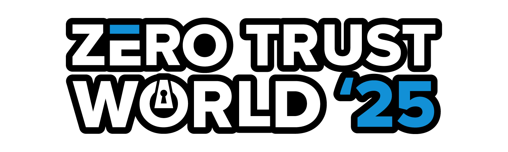
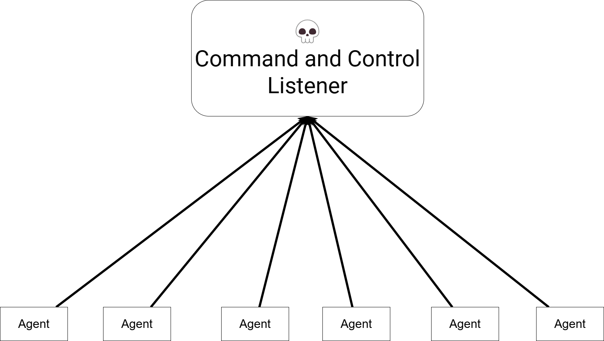
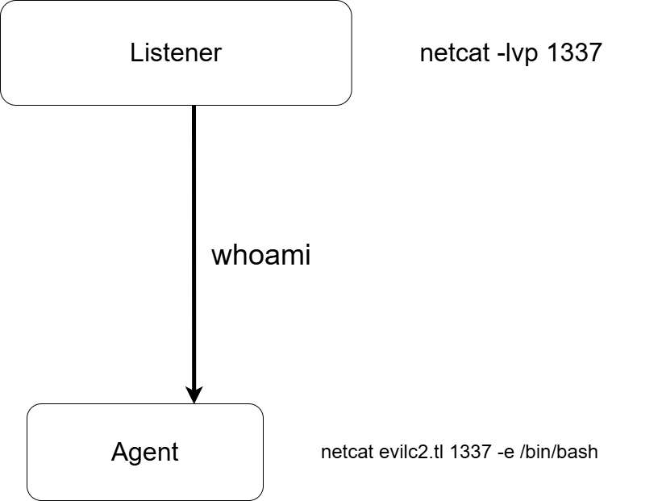
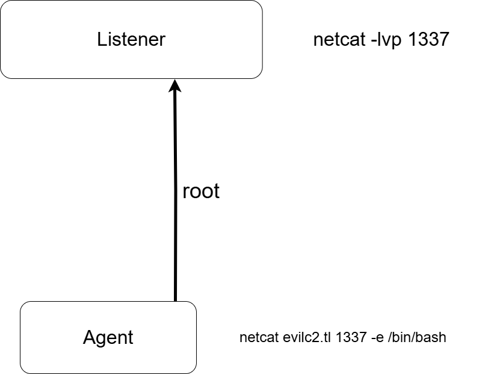

# Obfuscating Your C2

Welcome to the Advanced Red Team Course on C2 Obfuscation. If you have arrived
here after the Malware Development course, this is an opportunity to learn the
steps and practices adversaries use transform common C2 communication into
something mundane and inconspicuous.

# Table of Contents

- [Obfuscating Your C2](#obfuscating-your-c2)
- [Table of Contents](#table-of-contents)
- [Objectives](#objectives)
- [What is a Command and Control (C2)](#what-is-a-command-and-control-c2)
  - [The problem with a simple C2](#the-problem-with-a-simple-c2)
- [Reference Links](#reference-links)

# Objectives

- Learn to utilize encoding and encryption within C2 transport
- Understand the differences between a shell and a beacon
- Learn how to write Cobalt Strike Malleable C2 profiles

# What is a Command and Control (C2)

A Command and Control (C2) Application is a service that interacts with Agents
by giving commands to each of its agents and waiting to receive a response. It
functions in the same way that a manager at a company does by giving
instructions to a bunch of employees and awaiting responses from each one in
order to accomplish a larger goal.

A network C2 can function both by binding to each agent, such as with a Secure
SHell (SSH) botnet. But in most cases, the C2 is implemented in reverse by
having each agent reach back to the main controller or "mothership". This is a
more reliable option since an agents bind port might not be accessible from the
open internet. The most basic example of this would be a netcat listener. 

In every C2 there will be a network transmission to supply a command to the
agent. Often this is paired with a response from the agent, which can be as
simple as a success/fail statement, to a complete response from the agent
providing results from the command.

## The problem with a simple C2

The primary problem with this is that communications are unencrypted, but they're also very obvious as to what they are and what they do.

# Reference Links

- [Cobalt Strike Overview of Malleable C2](https://hstechdocs.helpsystems.com/manuals/cobaltstrike/current/userguide/content/topics/malleable-c2_main.htm)
- [Empire Malleable C2 Wiki](https://bc-security.gitbook.io/empire-wiki/listeners/malleable-c2)
- [Cobalt Strike Malleable C2 guild](https://github.com/threatexpress/malleable-c2)
- [Havoc profiles](https://havocframework.com/docs/profiles)
