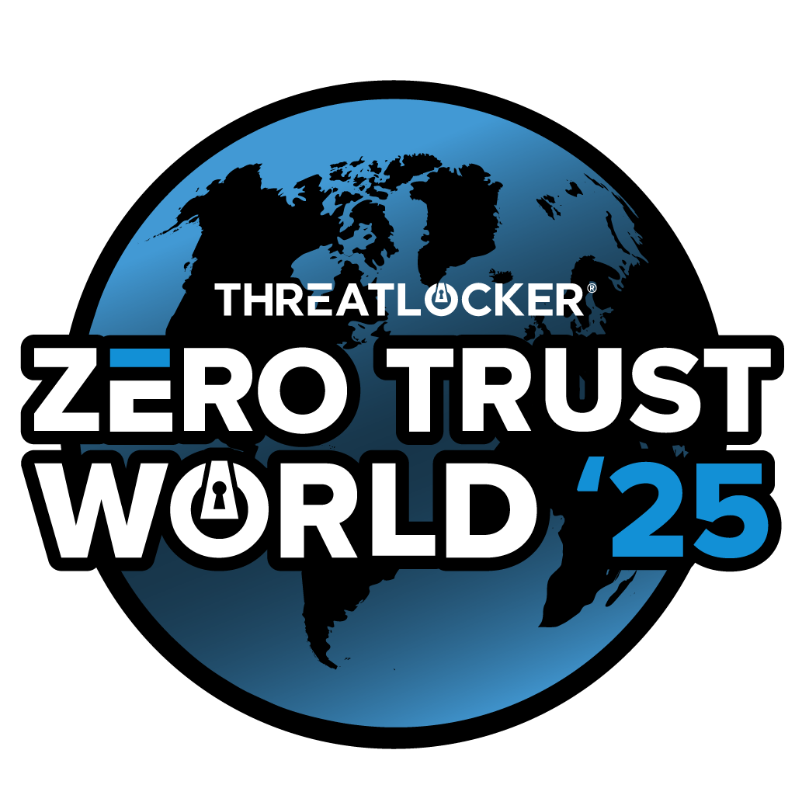

# Hacking Labs Content

This repository holds all the course content from hacking labs from ZTW2025.
The purpose of this was to share content with those that wish to follow along
interactively with the Hacking Lab's, get a recap, or extend their knowledge further.

## Courses

* **Lab: Malware Development:** [ZTW2025/Malware-Development (Course Content)](Malware-Development/README.md)
* **Lab: Metasploit:** [ZTW2025/Metasploit (Course Content)](Metasploit/README.md)
* **Lab: Obfuscating Your C2:** [ZTW2025/Obfuscating-Your-C2 (Course Content)](Obfuscating-Your-C2/README.md)
* **CTRL+ALT+PWN Challenge:** [ZTW2025/CTRL-ALT-PWN (guidelines and writeup)](CTRL-ALT-PWN/README.md)

> **Tip:** Click one of links above to access its respective course content.

## Values

Our Team at ThreatLocker makes it an absolute goal to educate and advocate for
a cyber-safe world. We have dedicated countless hours to crafting our content
to ensure a comprehensive and enriching learning experience. We hope you have an
amazing learning experience at ZTW2025!
